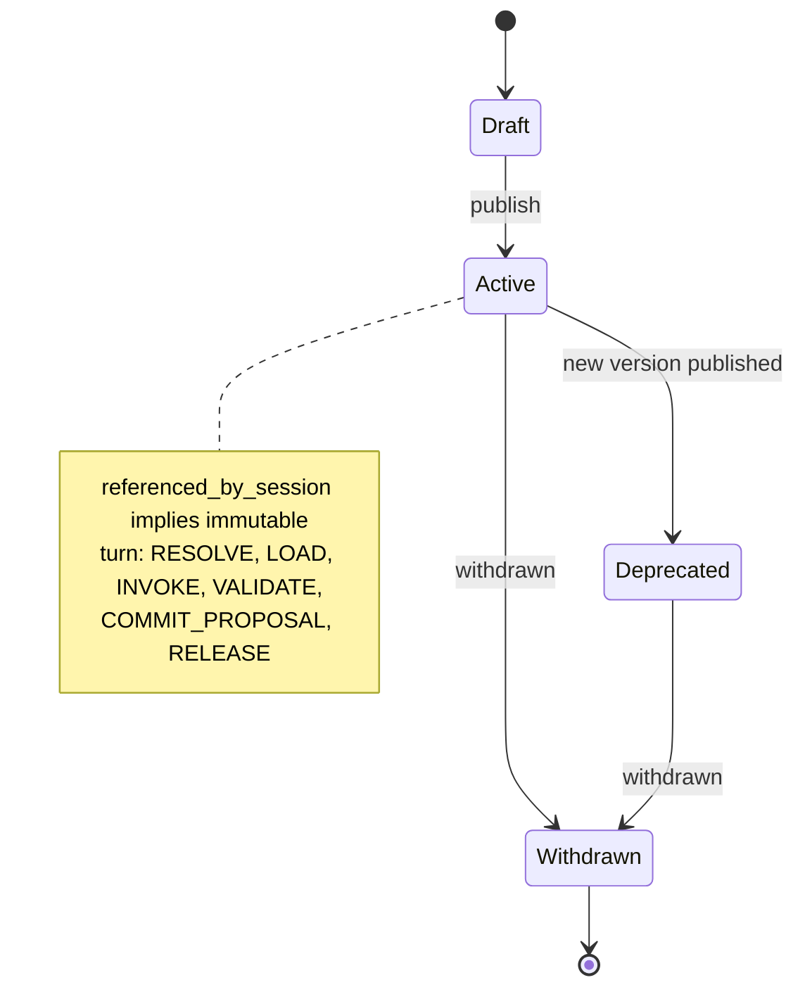

# Agent Model

**Version:** 1.0 · **Status:** design
**Companions:** [AGENT_PROTOCOLS.md](AGENT_PROTOCOLS.md), [PORTS.md](PORTS.md),
[STRUCTURED_REASONING.md](STRUCTURED_REASONING.md),
[ADR-005](adr/ADR-005-logical-agent-worker-pool.md)

<!-- trace: FR-203 -->
## 1. What an agent is

An agent is a **versioned declarative definition plus a logical runtime that the coordinator
instantiates inside a shared worker pool**. It is not a process, not a container and not a
persistent connection. Between turns an agent has no existence beyond its definition row and
its artifacts.

| Is | Is not |
| --- | --- |
| a row in `agent_definitions` | a Docker service |
| a `ReasoningStrategy` + LLM config + prompt + tool permissions | a chatbot persona |
| invoked per turn with an explicit input bundle | a long-running listener |
| stateless between turns; state lives in artifacts | the owner of session state |
| able to *propose* artifacts | able to *commit* artifacts |

This is [ADR-005](adr/ADR-005-logical-agent-worker-pool.md). One container per agent would
make 100-agent sessions impossible to schedule, and would tempt the design toward agents
holding authority they must not hold.

## 2. Definition anatomy

```yaml
agent:
  name: fiscal-analyst
  version: 3
  domain: fiscal
  role_kind: domain_expert      # domain_expert|critic|orchestrator|retriever|evaluator
  identity:
    mandate: >
      Evaluate fiscal space, deficit dynamics and financing constraints.
      You are not the decision maker.
    epistemic_stance: skeptical # skeptical|constructive|adversarial|neutral
    declared_interests:         # surfaced in the minority report, never hidden
      - "avoid deficit escalation"
  objectives:                   # the agent's own utility, distinct from session objectives
    - {ref: fiscal_sustainability, weight: 0.6}
    - {ref: debt_path,             weight: 0.4}
  constraints:
    - "Do not propose measures requiring primary legislation in < 12 months"
  knowledge:
    namespaces: [global, workspace, domain:fiscal, agent:fiscal-analyst]
    retrieval: {mode: hybrid, top_k: 12, rerank: bge-reranker-v2, min_trust: SECONDARY}
  reasoning:
    strategy: chain_of_critique
    strategy_version: 1.4.0
    rounds_within_turn: 2
  llm:
    config_ref: llmcfg/openai-compatible-primary
    temperature: 0.2
    max_output_tokens: 2048
    json_mode: true
  prompt: {ref: prompts/fiscal-analyst/v3.j2, hash: "sha256:…"}
  tools:
    allowlist: [search_documents, get_series, run_simulation]
    approval_required: [run_simulation]
  budget:
    max_tokens_per_turn: 8000
    max_turns_per_round: 1
  output_contract: agent_turn_v1   # JSON Schema, see API_CONTRACTS.md
```

Every field is persisted in a typed column or in a schema-bound `JSONB` block.
`declared_interests` is mandatory: an agent that optimises something the reader cannot see is
an unaccountable agent.

## 3. Role kinds

| Role | Purpose | May propose | May attack | May route | May score |
| --- | --- | --- | --- | --- | --- |
| `domain_expert` | substantive analysis in one domain | claims, alternatives, risks, assumptions | yes, in domain | no | own positions |
| `critic` | find defects regardless of author | critiques only | yes, everything | no | no |
| `orchestrator` | suggest next actions and routing | action proposals | no | **propose only** | no |
| `retriever` | fetch and pre-screen evidence | evidence candidates | no | no | no |
| `evaluator` | score alternatives against objectives | `alternative_scores` | no | no | yes |

No role may commit to the ledger. Only the coordinator writes; agents hand it proposals
([ADR-013](adr/ADR-013-coordinator-vs-orchestrator-authority.md)).

<!-- trace: FR-205 -->
## 4. The Critic

The Critic is deliberately adversarial and structurally independent.

- **C-1** It receives the same artifact stream as everyone else and no privileged context.
- **C-2** It is rewarded for finding defects, not for agreement. Its metric is *attack
  recall* against a seeded-defect corpus, not consensus contribution.
- **C-3** It cannot propose alternatives, so it cannot steer the answer.
- **C-4** It cannot be outvoted into silence: every `BLOCKING` critique it files appears in
  the final explanation whether or not it was resolved.
- **C-5** Its critiques are attackable — an expert may file `RESPONDS_TO` with
  `REJECT_WITH_JUSTIFICATION`, which the coordinator records and passes to consensus.
- **C-6** A Critic that files nothing for three rounds triggers `CRITIC_INACTIVE`, a
  degraded-state event, not a silent pass.

## 5. Lifecycle



`RESOLVE` binds the definition version · `LOAD` fetches prompt, tools and namespaces ·
`INVOKE` runs the strategy inside a worker under a deadline · `VALIDATE` checks the output
against `output_contract` and the artifact rules · `COMMIT_PROPOSAL` is performed **by the
coordinator**, not the agent · `RELEASE` returns the worker slot. A failed `VALIDATE` is a
retryable error emitting `OUTPUT_INVALID`; the raw invalid output is retained for audit but
never enters the graph.

<!-- trace: FR-210 -->
## 6. Versioning and reproducibility

- **A-1** A session pins `agent_def_id` (a specific version), never `logical_id`.
- **A-2** Editing a referenced definition is impossible; the API returns `409`. The migration
  path is "publish version N+1, start a new session".
- **A-3** The reproducibility manifest records definition version, prompt hash, strategy name
  and version, LLM config and model pin for every agent in the session.
- **A-4** Comparing sessions across agent versions is an experiment and MUST be declared as
  one ([EXPERIMENTATION.md](EXPERIMENTATION.md)).

T6-08 keeps `session_agents` as the immutable initial pin set and records coordinator-approved
membership deltas separately. A replacement is allowed only before round 1; an injection is effective
only in the next round. Effective membership replays deltas in reasoning-ledger order, so timestamp skew
cannot change agent order. Context assembly and session-scoped retrieval both reject a definition outside
the effective round. Replacement and injection never edit a referenced definition.

<!-- trace: FR-204 -->
## 7. The MVP agent set

| Agent | Domain | Stance | Signature contribution |
| --- | --- | --- | --- |
| `fiscal-analyst` | fiscal | skeptical | deficit path, financing space, tax incidence |
| `macroeconomic-analyst` | macroeconomic | constructive | growth, inflation, transmission channels |
| `social-policy-analyst` | social policy | skeptical | distributional incidence, vulnerable cohorts |
| `infrastructure-analyst` | infrastructure | constructive | capacity, delivery risk, capital programme |
| `risk-analyst` | risk | adversarial | tail scenarios, correlations, early-warning indicators |
| `critic` | cross-cutting | adversarial | attacks on every artifact type |
| `orchestrator` | control | neutral | action proposals, no state authority |

Each has a distinct objective vector, so genuine conflict is expected. Sessions where all
five experts agree in round 1 are flagged `SUSPECT_CONVERGENCE` for the metric profile —
agreement is not automatically a good result.

## 8. Adding an agent

Adding an agent is a configuration change, not a code change
([NFR-014](REQUIREMENTS.md)): write the definition, add the prompt template to the object
store, register any new `ReasoningStrategy` name, publish. The only code changes permitted
are a new strategy implementation behind an existing port. See
[EXTENDING.md](EXTENDING.md).

## 9. Failure modes and how the platform reacts

| Failure | Detection | Reaction |
| --- | --- | --- |
| provider outage | `LLMProvider` error class | bounded retry, then `DEGRADED_PROVIDER`; round continues with remaining agents |
| malformed output | schema validation | retry with repair prompt, then `OUTPUT_INVALID`, agent skipped for the round |
| budget exhausted | durable session/agent token and USD accounting | session fails once with `BUDGET_EXHAUSTED`; no empty round or silent skip |
| silent agent | no position for a target | recorded as `ABSTAIN`, counted in coverage — never imputed |
| sycophancy drift | disagreement-rate monitor | alert, and the experiment harness can pin a fresh initial assessment |
| prompt injection via evidence | gateway filter + provenance tagging | artifact quarantined, `INJECTION_SUSPECTED` event |
| worker crash | Temporal activity retry | turn re-dispatched idempotently by `(session, round, agent)` key |

