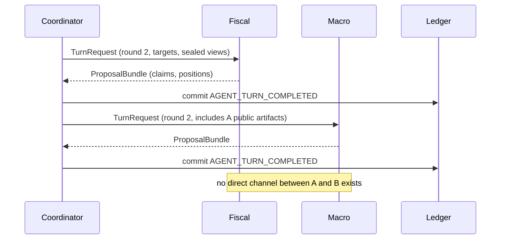

# Agent Interaction Protocol

**Version:** 1.0 · **Status:** design
**Companions:** [AGENT_MODEL.md](AGENT_MODEL.md), [ARCHITECTURE.md](ARCHITECTURE.md),
[API_CONTRACTS.md](API_CONTRACTS.md), [PORTS.md](PORTS.md)

<!-- trace: FR-208 -->
## 1. The one rule

**Agents never talk to agents.** Every interaction is mediated by the Workflow Coordinator:
an agent receives an input bundle assembled by the coordinator and returns a proposal bundle.
There is no shared memory, no message bus between runtimes, no "reply to @macro-analyst".

Why this is a rule and not a preference:

- peer-to-peer chatter makes the reasoning record incomplete — the interesting part is who
  said what to whom, and that must be in the ledger;
- it lets one agent's confidence leak into another's assessment, destroying independence;
- it makes cost, depth and termination uncontrollable;
- it prevents an emergent authority that no ADR granted.



## 2. Turn envelope

```json
{
  "protocol_version": "1.0",
  "kind": "turn_request",
  "session_id": "sesn_01J…",
  "round": 2,
  "phase": "ARGUE",
  "turn_id": "turn_01J…",
  "causation_id": "evt_01J…",
  "deadline_at": "2026-09-04T11:02:00Z",
  "canonicalizer_version": "canonicalizer@1",
  "agent": {"def_id": "agd_01J…", "version": 3, "role_kind": "domain_expert"},
  "input": {
    "problem": {"ref": "prob_01J…"},
    "targets": [{"kind": "proposition", "id": "prp_01J…"}],
    "visible_artifacts": ["clm_01J…", "evd_01J…"],
    "sealed": true,
    "critiques_to_address": ["crt_01J…"],
    "budget_remaining_tokens": 6400
  },
  "idempotency_key": "sesn_01J…:2:ARGUE:agd_01J…"
}
```

The reply is a `proposal_bundle` containing typed artifact proposals only — never free-form
prose as the primary payload, and never a claim of authority.

```json
{
  "protocol_version": "1.0",
  "kind": "proposal_bundle",
  "turn_id": "turn_01J…",
  "artifacts": [
    {"op": "propose", "type": "claim", "statement": "…", "normalized": "…",
     "direction": "OPPOSES", "strength": "MODERATE",
     "evidence_refs": ["evd_01J…"], "confidence": 0.62,
     "uncertainty": {"type": "EPISTEMIC", "representation": "INTERVAL",
                     "low": 0.4, "high": 0.8}},
    {"op": "propose", "type": "position",
     "target": {"kind": "proposition", "id": "prp_01J…"},
     "stance": "CONDITIONALLY_SUPPORT",
     "evidence_disposition": "NO_EVIDENCE", "evidence_ids": [],
     "conditions": ["fiscal headroom >= 1.5% GDP"],
     "rationale": "…"}
  ],
  "requests": [
    {"kind": "simulation", "spec_ref": "simsp/…"},
    {"kind": "evidence",   "query": "…", "namespace": "domain:fiscal"}
  ],
  "self_reported_limits": ["no access to sub-national fiscal data"]
}
```

`self_reported_limits` is mandatory on the first turn of a session and optional afterwards. An
agent that never reports a limitation is treated as miscalibrated, not omniscient.

Every position proposal carries exactly one `evidence_disposition`: `CITED` with at least one
resolvable `evidence_id`, or `NO_EVIDENCE` with an empty list. The latter is copied into hash-covered
artifact metadata and the ledger payload; it is not a fake evidence UUID. Missing or inconsistent
disposition and fabricated references fail before commit. See
[PHASE6_ACCEPTANCE.md §2](PHASE6_ACCEPTANCE.md#2-executable-contract-choices).

## 3. Phases within a round

| Phase | Who acts | Output | Coordinator guarantee |
| --- | --- | --- | --- |
| `ASSESS` | all experts, independently | initial claims, assumptions | sealed: no cross-agent context (FR-209) |
| `DECOMPOSE` | experts + orchestrator proposal | propositions | deduplicated by canonical form |
| `ARGUE` | all | positions on propositions | every target gets a stance or `ABSTAIN` |
| `CRITIQUE` | critic (+ peers) | critiques | each critique gets a disposition slot |
| `REVISE` | targeted experts | new versions, responses | `SUPERSEDES` links maintained |
| `SCORE` | evaluator | alternative scores | scores carry source and uncertainty |
| `CONVERGE?` | convergence strategy | continue or stop | decision is deterministic and logged |

Phase order is fixed. The orchestrator may propose advancing only to the immediate successor; a skip,
repeat or backtrack is rejected and recorded rather than applied or silently omitted.

<!-- trace: FR-206 -->
### 3.1 Orchestrator proposal policy

T6-07 narrows orchestrator output to strict, frozen `DECOMPOSE`, `ROUTE`, or `ADVANCE_PHASE`
recommendations. The envelope pins workspace, session, orchestrator definition/version, turn,
correlation, causation, round and named phase. It cannot carry an artifact write, lifecycle state,
workflow command, or generic mutation payload. `DECOMPOSE` recommends invoking the T6-02 path; it
does not replace T6-02 semantic validation or carry proposition artifacts itself.

`orchestrator-coordinator-policy@1` compares every proposal pin with coordinator-owned context,
requires every `ROUTE` target to be in the coordinator-provided eligible set, and permits
`ADVANCE_PHASE` only to the immediate successor in `ASSESS → DECOMPOSE → ARGUE → CRITIQUE → REVISE
→ SCORE`. The decision appends exactly one retry-stable `ORCHESTRATOR_PROPOSAL_ACCEPTED` or
`ORCHESTRATOR_PROPOSAL_REJECTED` event as `ActorClass.POLICY`. Its payload records proposal hash,
orchestrator attribution, action, targets, rationale, stable rule/version and `applied: false`.
Acceptance remains inert until later coordinator workflow code explicitly applies it.

<!-- trace: FR-209 -->
## 4. Sealed assessment

Round 1 `ASSESS` runs with `sealed: true`: each agent sees the problem, its own namespaces and
the constraints — nothing produced by any other agent. This is the control measurement for
groupthink. Later rounds are open. The delta between sealed and open positions is reported as
the **anchoring metric** ([METRICS.md](METRICS.md)); a large move toward the first speaker is
evidence of herding, not of persuasion.

<!-- trace: FR-204 -->
### 4.1 Shipped policy-expert catalogue

T6-05 ships fiscal, macroeconomic, social-policy, infrastructure and risk definitions as one
deterministic catalogue. Each definition has a distinct objective vector and analytical stance, a
workspace-scoped UUIDv5 logical identity and version identity, and the pinned `evidence-first@1.0.0`
strategy. Its prompt is a non-empty UTF-8 package resource whose literal SHA-256 digest is part of the
definition; loading fails if the shipped bytes drift. Staging writes those exact bytes through the
`ObjectStore` under a content-addressed key and rejects a returned digest mismatch.

The catalogue does not create a second runtime path. Every shipped definition is converted to the same
immutable pinned snapshot and executes through the existing agent-turn activity. The deterministic mock
contract exercises all five definitions with sealed round-one input and requires schema-valid proposal
bundles plus provider-independent usage attribution. Shared-pool dispatch and completion-order handling
remain T6-06 concerns.

## 5. Message kinds

| Kind | Direction | Commits? |
| --- | --- | --- |
| `turn_request` | coordinator → agent | no |
| `proposal_bundle` | agent → coordinator | no |
| `orchestrator_proposal` | orchestrator → coordinator policy | no |
| `evidence_request` | agent → coordinator → retriever | no |
| `simulation_request` | agent → coordinator → sim worker | no |
| `critique_notice` | coordinator → target author | yes, as an event |
| `human_directive` | user → coordinator | yes |
| `round_advance` | coordinator → ledger | yes |
| `termination` | coordinator → ledger | yes |

Only the coordinator produces kinds marked *commits*. An agent that emits a `round_advance` is
a protocol violation and the worker rejects the bundle.

## 6. Ordering, idempotency, concurrency

- **O-1** Every turn is keyed by `(session, round, phase, agent_def_id)`. Redelivery is
  idempotent: the coordinator returns the previously committed bundle.
- **O-2** Within a phase, agents run concurrently up to the worker pool limit; the commit
  order is the coordinator's, not the completion order, so replay is deterministic.
- **O-3** Cross-round causality is recorded via `causation_id`; a proposal may only reference
  artifacts with a lower or equal `seq`.
- **O-4** A turn that exceeds `deadline_at` is abandoned, recorded as `TURN_TIMEOUT`, and the
  agent's stance for that phase is `ABSTAIN`.
- **O-5** Concurrent edits to the same logical artifact are serialized by the coordinator:
  first commit wins, later ones become new versions or are rejected with `409`.
- **O-6** Membership changes lock the session lifecycle row and a transaction-scoped membership key.
  Replacement is pre-round-1 only; injection targets exactly the next round. Append-only deltas replay by
  ledger sequence, and only effective definitions may receive context or session-scoped retrieval access.
- **O-7** Durable session and per-definition token/USD totals are checked immediately before dispatch and
  after call accounting. Equality exhausts the ceiling and commits one `BUDGET_EXHAUSTED` lifecycle event.

T6-04 derives artifact, graph-node and ledger-event IDs from the turn ID plus proposal order. The
PostgreSQL adapter takes one transaction advisory lock per turn before checking for prior state. A complete
exact retry returns the previously committed artifacts and events; partial or content-conflicting prior
state fails closed. New bundles validate every same-session, active, non-future typed reference before the
first write, then commit artifacts, graph projections and ledger events through one caller transaction.

T6-08 composes this commit path with bounded dispatch. The 20-agent acceptance fixture runs four workers,
preserves pinned input order despite completion races, commits one attributed claim per logical agent, and
asserts the complete attribution object in both artifact metadata and turn-completion events.

T7-01 through T7-04 reuse that path for the shipped cross-cutting Critic. A coordinator-owned
`CritiqueAssignment` must match the hydrated `CRITIQUE` context exactly. Completed output is restricted to
new `OPEN` Critiques against assigned targets; the coordinator derives one `ATTACKS` edge per Critique and
commits it with type/severity qualifiers, the artifact and ledger events. The shared commit path requires
the exact assignment; both the dedicated Critic and domain peers are restricted to the `CRITIQUE` phase.
The third consecutive completed empty Critic round emits
`CRITIC_INACTIVE`; timeout remains `TURN_TIMEOUT`, and neither result claims that the record is sound.

T7-05/T7-06 preserve activity execution metadata through strategy selection and bounded dispatch instead of
reducing an activity result to its proposal. A response runs in a sealed author-specific `REVISE` context:
the target's `AGENT` owner may choose one of the seven FR-503 dispositions, while human/service-owned and
foreign targets fail before writes. Every accepted response appends a Critique successor. `REVISE` also
appends a schema-valid successor of the same target kind/logical id/owner and projects coordinator-derived
`SUPERSEDES` plus `RESPONDS_TO`; a revised Critique also receives its derived `ATTACKS`. Exact requests and
results are durable and retry-stable. Evidence requests remain explicit pending retrieval completion, and
simulation requests remain explicitly deferred to Phase 8.

## 7. Disagreement protocol

Disagreement is a first-class output, not a failure to converge.

1. Two agents hold opposite stances on the same proposition → `DISAGREEMENT_DETECTED`.
2. The coordinator requires each to state the proposition under which they *would* agree
   (`conditions`). Many apparent disagreements dissolve into different scopes.
3. Residual disagreement is typed: `EVIDENCE` (different sources), `INTERPRETIVE` (different
   canonicalization), `VALUE` (different objective weights), `MODEL` (different causal
   assumptions), `STRATEGIC` (different beliefs about actors).
4. `VALUE` disagreement is never resolved by the platform. It is reported to the human.
5. Unresolved disagreement survives into the outcome as `PARTIAL_CONSENSUS`, `PARETO_SET` or
   `NO_CONSENSUS`, and into the minority report.

## 8. Protocol versioning

`protocol_version` is carried in every envelope. Minor versions add optional fields; major
versions may remove fields and require an ADR. A worker MUST reject a `turn_request` whose
major version it does not implement rather than guessing — silent misinterpretation of an
interaction contract is the worst available failure.

