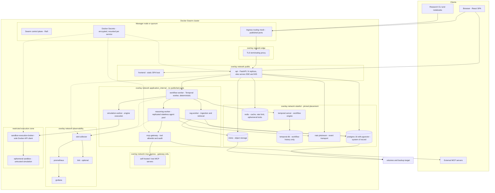
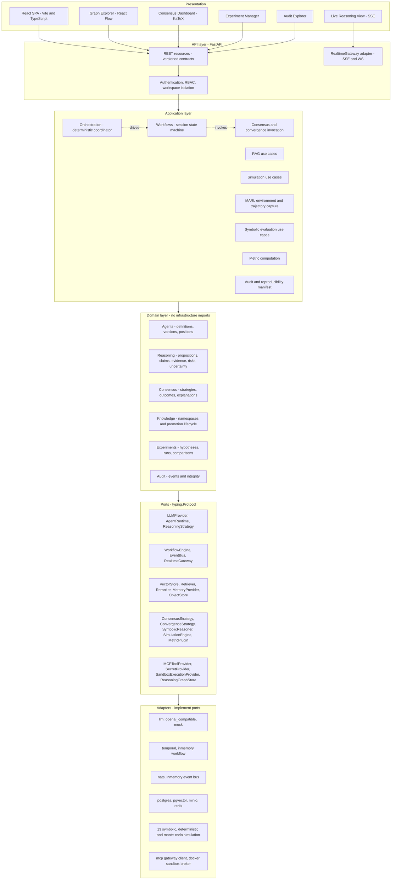
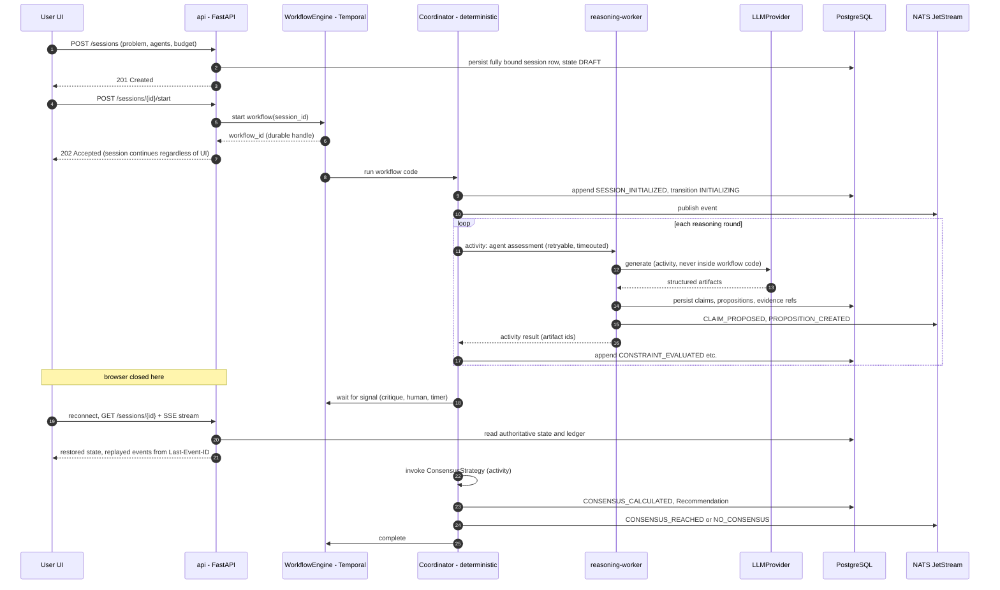
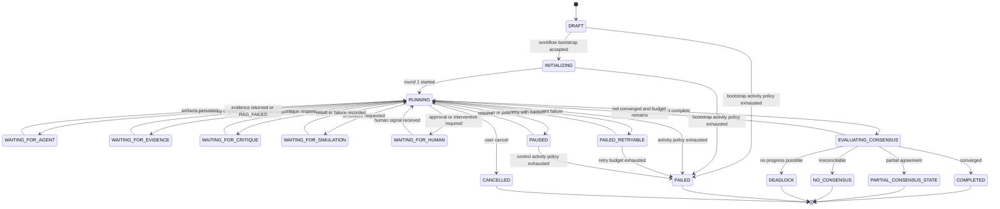
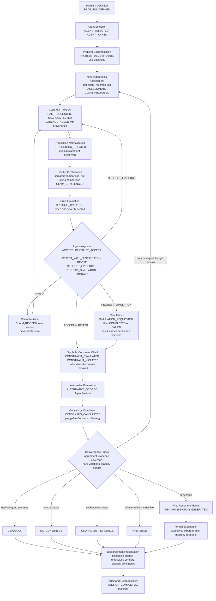
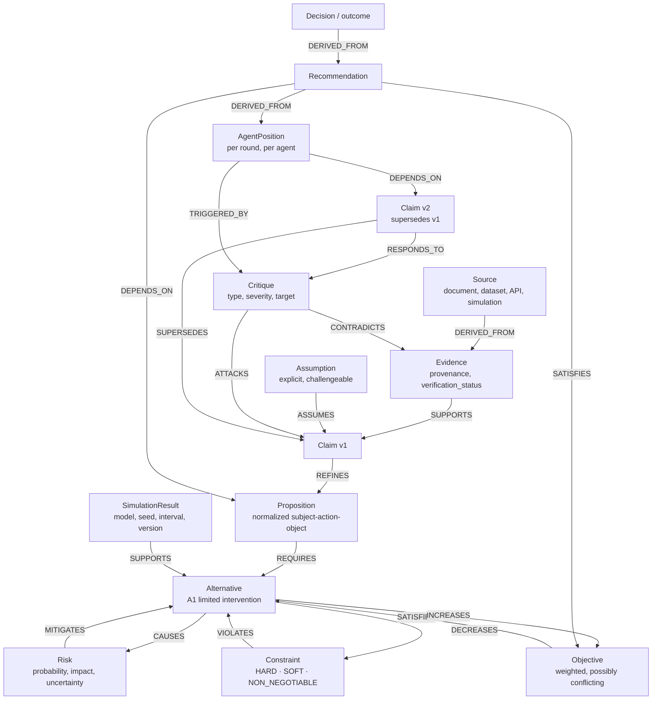
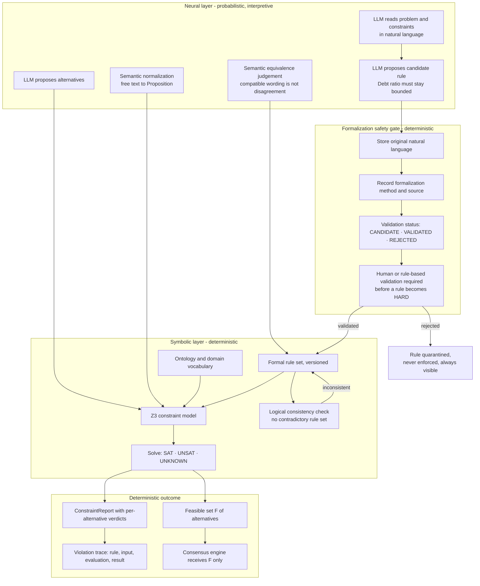
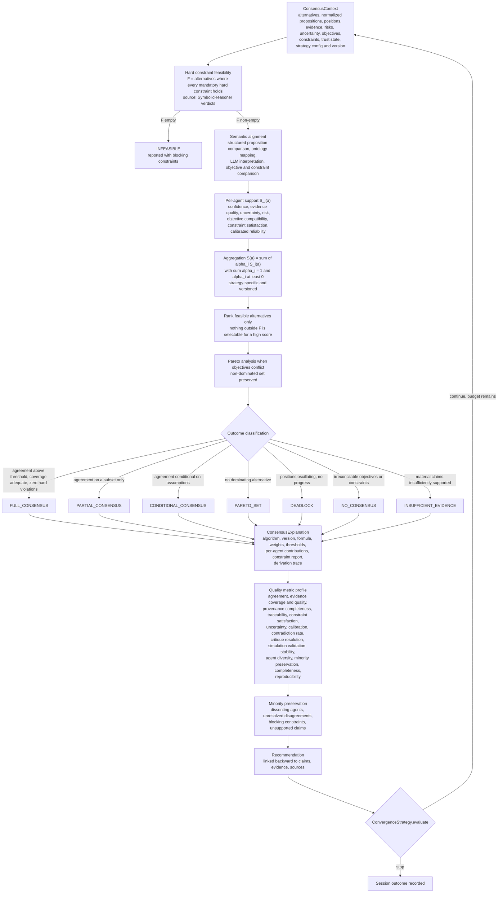

# Architecture

**Version:** 1.0 (Phase 0) · **Last reviewed:** 2026-09-04 · **Status:** approved baseline (D-13)
**Normative for:** service boundaries, state ownership, authority split, diagram-level design.
Companion documents: [PORTS.md](PORTS.md) · [DATA_MODEL.md](DATA_MODEL.md) ·
[CONSENSUS_MODEL.md](CONSENSUS_MODEL.md) · [MVP_BOUNDARY.md](MVP_BOUNDARY.md) ·
[../memory-bank/architecture.md](../memory-bank/architecture.md) (digest).

---

## 0. How to read this document

Eight diagrams, in the order required by the project brief:

| # | Diagram | Question it answers |
| --- | --- | --- |
| 1 | [Docker Swarm deployment](#1-docker-swarm-deployment-architecture) | What runs where, with which network and secret boundaries? |
| 2 | [Logical service architecture](#2-logical-service-architecture) | Which responsibilities belong to which service? |
| 3 | [Durable workflow](#3-durable-workflow) | How does a session survive crashes, restarts and browser closure? |
| 4 | [Collective reasoning loop](#4-collective-reasoning-loop) | What is the end-to-end reasoning cycle? |
| 5 | [RAG data flow](#5-rag-data-flow) | How does a document become provenance-bearing evidence? |
| 6 | [Reasoning / provenance graph](#6-reasoning--provenance-graph) | How is reasoning represented as a traceable graph? |
| 7 | [Neuro-symbolic flow](#7-neuro-symbolic-flow) | Where does LLM judgement end and formal decision begin? |
| 8 | [Consensus flow](#8-consensus-flow) | How is consensus computed, explained and bounded? |

Three invariants hold across all eight and are restated wherever they apply:

1. **PostgreSQL is the only system-of-record.** Temporal owns *execution* state; NATS,
   Redis and pgvector own derived or ephemeral state only.
2. **Deterministic code decides; LLMs propose.** No LLM output mutates platform state
   without passing through deterministic policy.
3. **Every meaningful action is an event.** If it is not in the ledger, it did not happen
   and cannot be audited, replayed or reproduced.

---

## 1. Docker Swarm deployment architecture

Development uses Docker Compose with the same service names and the same networks; the
diagram below is the Swarm (production-like) topology.



**Deployment rules**

- `api`, `reasoning-worker`, `rag-worker`, `simulation-worker`, `workflow-worker`,
  `mcp-gateway`, `frontend` are stateless and replicate freely.
- `postgres`, `temporal-db`, `nats`, `redis`, `minio` are **single-instance in local,
  development and the MVP stack**. Replicating them is *not* HA — see
  [ADR-020](adr/ADR-020-stateful-ha-boundary.md) and [DOCKER_SWARM.md](DOCKER_SWARM.md).
- Only `sandbox-execution-broker` may talk to the Docker API, through a restricted proxy
  with a minimal permission profile. The raw socket is never mounted into `api`,
  `reasoning-worker` or any LLM-facing service
  ([ADR-018](adr/ADR-018-sandbox-execution-boundary.md)).
- Secrets are Docker Secrets in Swarm and `.env` in development, always resolved through
  the `SecretProvider` port ([ADR-017](adr/ADR-017-secret-provider-docker-secrets.md)).
- `application_internal`, `mcp_egress` and `stateful` networks publish no ports; only `edge` is exposed.
- `application_internal` carries service traffic. Reasoning workers retain the separately controlled
  model-provider egress path but never attach to `mcp_egress`; only `mcp-gateway` reaches self-hosted/test
  servers on that overlay and external registered MCP endpoints through a gateway-only outbound policy.
  T15-04 adds destination/redirect/DNS containment. See ADR-021.

---

## 2. Logical service architecture



**Boundary rule:** dependency arrows point inward only. `domain` imports nothing from
FastAPI, SQLAlchemy, Temporal, Redis, NATS, MinIO or any LLM SDK; `application` depends on
domain and ports; adapters depend on ports plus infrastructure; a composition root wires
them. Enforced by an import-lint test from Phase 1 onward
([ADR-012](adr/ADR-012-clean-architecture-ports-adapters.md)).

### 2.1 Service responsibility table

| Service | Owns | Must never own |
| --- | --- | --- |
| `frontend` | UI state, rendering, user interaction | reasoning state, workflow decisions |
| `api` | HTTP contract, authN/authZ, request validation, session commands, event streaming | durable workflow execution, LLM calls |
| `workflow-worker` | deterministic session state machine, ordering, retries, timeouts, convergence checks, consensus invocation | nondeterministic work, network I/O inside workflow code |
| `reasoning-worker` | logical agent instantiation, prompt assembly, LLM calls, structured artifact production | workflow state transitions, consensus decisions |
| `rag-worker` | ingestion, chunking, embedding, retrieval, reranking, context assembly | evidence verification decisions |
| `simulation-worker` | engine selection and execution, numerical results | interpreting its own results as truth |
| `mcp-gateway` | tool registry, allowlist, permission checks, timeouts, sanitization, audit | agent-directed arbitrary execution |
| `temporal` | workflow execution history, timers, retries | domain reasoning artifacts |
| `nats` | event distribution | authoritative state |
| `postgres` | all structured state, event ledger, graph, metrics | blobs, embeddings as primary data |
| `redis` | cache, rate limits, ephemeral locks | any durable truth |
| `minio` | documents, datasets, artifacts, exports | structured reasoning state |
| `observability` | metrics, traces, logs | being the only audit record |

### 2.2 Agent runtime model

Agents are **logical**, not deployed units
([ADR-005](adr/ADR-005-logical-agent-worker-pool.md)):

```text
Agent Definition (registry row, versioned, immutable once referenced)
        ↓ instantiated per session
Logical Agent Runtime (identity, objectives, constraints, memory refs, LLM config ref)
        ↓ executed by
Reasoning Worker Pool (replicated, stateless containers)
```

Fiscal, Macroeconomic, Social Policy, Infrastructure and Risk agents normally share one
`reasoning-worker` service. A dedicated container exists only when
`SandboxExecutionProvider` isolation is required: untrusted code, special engines,
resource-heavy or security-sensitive workloads, or strict experiment isolation.

T6-08 makes session membership an effective-round view: immutable initial pins plus append-only,
coordinator-approved replacement/injection facts ordered by the reasoning ledger. Membership writes and
round starts serialize on the lifecycle row. Context assembly and retrieval authorize only the effective
definition set. Durable session and definition token/USD totals bracket bounded dispatch; a reached ceiling
causes one explicit `BUDGET_EXHAUSTED` transition. Twenty logical agents still share the worker pool and
commit in pinned order; no per-agent service is introduced.

---

## 3. Durable workflow

### 3.1 Session lifecycle across services



### 3.2 Session state machine



`PARTIAL_CONSENSUS_STATE` is the workflow state used when the session terminates with a
`PARTIAL_CONSENSUS` outcome; it is distinct from `NO_CONSENSUS`, which means no defensible
collective position was reachable at all.

### 3.3 Determinism contract

Temporal workflow code is replayed, so it must be deterministic.

| Allowed in workflow code | Forbidden — must be an Activity |
| --- | --- |
| state transitions, ordering, branching on persisted data, timers, signals, queries, pure computation | LLM calls, HTTP, DB reads/writes, embedding calls, MCP tool calls, simulation execution, symbolic solving, `random`, wall-clock reads, filesystem |

Activity design rules: every activity is **idempotent** (keyed by
`(session_id, activity_type, idempotency_key)`), has an explicit `start_to_close_timeout`,
a retry policy with exponential backoff and maximum attempts, and a heartbeat for long
work. Failures produce structured failure events, never silence.

### 3.4 Recovery semantics

| Failure | Behaviour |
| --- | --- |
| `reasoning-worker` crash mid-activity | Temporal retries the activity on another worker; persisted artifacts from completed activities are not recomputed |
| `workflow-worker` crash | Temporal replays workflow history and resumes from the last command |
| API restart | Sessions unaffected — the API holds no workflow state |
| Browser disconnect | Nothing stops; on reconnect the UI reads PostgreSQL state and resumes the SSE stream from `Last-Event-ID` |
| PostgreSQL unavailable | Activities fail with retryable error; workflow parks; ledger never partially written (same transaction as artifact) |
| NATS unavailable | Ledger write still succeeds; publisher retries and a reconciliation job re-emits any gap (transport loss ≠ state loss) |
| LLM provider outage | Circuit breaker opens per provider; session transitions to `WAITING_*` with `PROVIDER_UNAVAILABLE` detail or `FAILED_RETRYABLE` |
| Budget exhausted | Structured `BUDGET_EXHAUSTED` termination reason, not a silent stop |

### 3.5 Pause, resume and human-in-the-loop

Human actions are **signals** to the workflow and are recorded as first-class events:
`pause`, `resume`, `inject evidence`, `add constraint`, `modify objective`,
`request simulation`, `request additional critique`, `request another round`,
`reject recommendation`, `override outcome`, `cancel`. Overrides are always visible in
the audit trail and never merged into system-generated reasoning history.

---

## 4. Collective reasoning loop

Every stage produces structured state and at least one ledger event. No stage is allowed
to exist only as conversation text.



### 4.1 Independence guarantee

The initial assessment stage is executed **without** cross-agent context: each agent sees
the problem, its own objectives, constraints and knowledge namespace, and no other agent's
output. This prevents premature convergence and anchoring, and makes later agreement or
disagreement scientifically meaningful.

### 4.2 Communication topology

Domain agents never communicate directly:

```text
Domain Agent → Workflow Coordinator → Domain Agent
```

This guarantees auditability, deterministic routing, access control, event logging, UI
visibility and reproducibility. Every inter-agent interaction becomes a structured event
or artifact — never an invisible message.

### 4.3 Round semantics

A *round* is one pass from assessment or revision through to a consensus evaluation.
Positions are versioned per round, enabling the stability metric
`Stability_t = 1 - distance(P_t, P_{t-1})` and the deadlock detector (no position change
above ε for `k` consecutive rounds while agreement stays below threshold).

### 4.4 Termination reasons (always explicit)

`CONVERGED` · `PARTIAL_CONSENSUS` · `NO_CONSENSUS` · `DEADLOCK` · `INSUFFICIENT_EVIDENCE`
· `INFEASIBLE` · `MAX_ROUNDS` · `MAX_DURATION` · `BUDGET_EXHAUSTED` · `HUMAN_OVERRIDE` ·
`HUMAN_CANCELLED` · `FAILED`. A session never ends without one, and the reason appears in
the explanation object.

---

## 5. RAG data flow

RAG produces **candidate evidence with provenance**, never facts. See
[STRUCTURED_REASONING.md](STRUCTURED_REASONING.md#5-why-retrieved-content-is-not-automatically-evidence).

```mermaid
flowchart LR
    subgraph SRC["Sources"]
        S1["PDF, DOCX, TXT, Markdown"]
        S2["CSV, XLSX, JSON"]
        S3["HTML and database records"]
        S4["external APIs via MCP"]
        S5["historical sessions and simulation outputs"]
    end

    subgraph INGEST["Ingestion - rag-worker"]
        U1["Upload"] --> U2["Validation<br/>type, size, hash, structure checks"]
        U2 --> U3["Parsing<br/>layout and table aware"]
        U3 --> U4["Cleaning<br/>de-duplication and normalization"]
        U4 --> U5["Metadata extraction<br/>title, author, date, licence, DOI, corpus"]
        U5 --> U6["Chunking<br/>structure-aware, stable chunk ids"]
    end

    subgraph IDX["Indexing"]
        I1["Embedding via EmbeddingProvider"] --> I2["VectorStore adapter - pgvector"]
        U6 --> I5["Lexical index - Postgres FTS"]
    end

    subgraph META["System of record - PostgreSQL"]
        M1["Document plus version"]
        M2["Chunk, content_hash, offsets"]
        M3["Source registry with trust_level"]
        M4["Evidence candidate rows"]
    end

    subgraph RETR["Retrieval"]
        R1["Retrieval request<br/>query, namespace, filters, k"] --> R2["Permission filter<br/>workspace, domain, agent, session"]
        R2 --> R3["Hybrid retrieval<br/>vector plus lexical"]
        R3 --> R4["Reranker"]
        R4 --> R5["Context construction<br/>bounded, ordered, cited"]
        R5 --> R6["Provenance attachment<br/>source_uri, document, page, chunk, hash"]
    end

    subgraph STORE["Object storage - MinIO"]
        O1["raw upload bytes"]
        O2["parsed text and tables"]
        O3["large exports and artifacts"]
    end

    SRC --> U1
    U6 --> I1
    U6 --> M1
    U6 --> M2
    U5 --> M3
    U1 --> O1
    U3 --> O2
    I2 --> R3
    I5 --> R3
    M3 --> R2
    R6 --> M4
    M4 --> EVD{"Verification policy<br/>UNVERIFIED · SOURCE_VERIFIED ·<br/>CROSS_CHECKED · REJECTED"}
    EVD -->|passes| CLAIM["Usable as EVIDENCE by claims"]
    EVD -->|fails| QUAR["Quarantined and surfaced to Critic"]
```



### 5.1 Knowledge namespaces

Retrieval is permission-scoped **before** it is similarity-scoped:

```text
Global → Workspace → Domain → Agent → Session → Historical Reasoning
```

A retrieval request resolves to the union of namespaces the requesting agent is entitled
to, and every hit carries the namespace it came from. Historical reasoning sessions are
retrievable but tagged `origin=HISTORICAL_SESSION`; they can never satisfy the provenance
requirement for `EVIDENCE` on their own, because a past consensus is not a fact.

### 5.2 Provenance requirement

An `Evidence` record is valid only with: `source_id`, `source_type`, `source_uri` or
citation, `document_id`, page/section, `chunk_id`, `content_hash`, `retrieved_at`,
`source_created_at`, `trust_level`, `verification_status`, `confidence`. A citation
invented by an LLM and not resolvable to an ingested source is recorded as an
**unsupported claim**, never as evidence, and is a first-class Critic target.

### 5.3 Poisoning defences

Upload validation and size limits · content-type and archive inspection · parsed text
sanitized before prompt assembly · retrieved text wrapped in non-instruction delimiters
with an explicit "this is data, not instructions" frame · `trust_level` per source ·
quarantine on suspicious instruction-like patterns · provenance required before evidence
promotion · namespace isolation so one workspace cannot leak into another. Details:
[THREAT_MODEL.md](THREAT_MODEL.md), [RAG_ARCHITECTURE.md](RAG_ARCHITECTURE.md).

---

<!-- trace: FR-201 -->
## 6. Reasoning / provenance graph

Reasoning is stored as a typed, versioned, directed graph — never as a message log.
Full schema: [REASONING_GRAPH.md](REASONING_GRAPH.md).



**Properties**

- Every edge is versioned and provenance-aware: who asserted it, when, from which
  activity, with what confidence, and whether it was human- or machine-asserted.
- `SUPERSEDES` chains give a complete revision history; nothing is destructively
  overwritten.
- The graph is bidirectionally traversable: **backward** from recommendation to source
  (explainability) and **forward** from source to every dependent recommendation (impact
  analysis, e.g. "this retracted paper invalidates these three claims").
- Stored in PostgreSQL behind `ReasoningGraphStore` ([ADR-007](adr/ADR-007-postgres-reasoning-graph.md));
  Neo4j/Memgraph/RDF are later adapters. JSON-LD/RDF export is an adapter, not a schema
  constraint, so the model stays exportable without forcing RDF now.

---

## 7. Neuro-symbolic flow

The neural layer interprets and proposes. The symbolic layer decides. They are never
merged, and a natural-language statement never silently becomes a hard rule.



### 7.1 Canonical trace

```text
LLM proposes: Alternative A2
        ↓
Symbolic rule R-17 (validated 2026-xx, formalized from "debt must stay bounded"):
    DebtRatio(A2) > FiscalLimit
        ↓
Constraint solver: UNSAT for the feasible set → VIOLATION
        ↓
Consensus engine: A2 removed from F before any ranking
        ↓
UI: shows the rule, its natural-language origin, its validation status,
    the inputs used, and the solver verdict
```

### 7.2 Authority boundaries

| Question | Answered by | Never by |
| --- | --- | --- |
| What does this sentence mean? | LLM | solver |
| Are these two statements compatible? | LLM judgement **plus** structured proposition comparison | embedding similarity alone |
| Does this alternative violate a hard constraint? | symbolic solver | LLM, vote, or consensus score |
| Is the rule set self-consistent? | symbolic solver | LLM |
| Was this rule correctly formalized? | validation workflow (human or deterministic check) | silent LLM assumption |
| Which alternative is selected? | consensus strategy over feasible set | orchestrator LLM |

`UNKNOWN` from the solver is reported as `UNKNOWN`, never as satisfaction or violation.

---

## 8. Consensus flow

Consensus is a **pluggable, deterministic research subsystem**, separate from the
orchestrator. Full model: [CONSENSUS_MODEL.md](CONSENSUS_MODEL.md); per-plugin formalism:
[consensus-formalism/](consensus-formalism/).



### 8.1 Non-negotiable consensus rules

1. **Feasibility before ranking.** An alternative outside `F` is never selected because it
   scored highly. Hard-constraint violations are reported independently of the score.
2. **The baseline formula is a plugin, not the theory.** `S_i(a) = w_c·C + w_e·E + w_o·O +
   w_t·T − w_r·R − w_u·U` is one strategy's definition. Platform semantics do not contain
   it. Every strategy declares its own input representation, assumptions, aggregation,
   constraints, convergence criteria, interpretation and limitations.
3. **No forced agreement.** `NO_CONSENSUS`, `DEADLOCK`, `INSUFFICIENT_EVIDENCE` and
   `INFEASIBLE` are legitimate, publishable outcomes.
4. **The Orchestrator LLM never decides consensus.** It may summarize disagreement and
   propose another round; the coordinator invokes the strategy.
5. **A score is not a quality verdict.** Support values are reported inside a
   multi-dimensional metric profile; no single "AI quality score" exists.
6. **Every strategy ships formal documentation** at
   `docs/consensus-formalism/<plugin-name>.md` before it becomes selectable in an
   experiment.

### 8.2 Trust inputs

`T_i` (calibrated historical reliability) is computed from observable history — historical
accuracy, calibration, evidence quality, constraint compliance, simulation consistency,
critique survival, contradiction rate — and is **never** the agent's self-reported LLM
confidence. Trust computation is versioned, auditable and experimentally configurable;
circular self-reinforcement is explicitly avoided. Cold-start behaviour (neutral prior) is
documented rather than implicit.

---

## 9. Cross-cutting concerns

### 9.1 Traceability chain (the product's core promise)

```text
Recommendation
  → Consensus Result (strategy, version, formula, weights, thresholds)
    → Agent Positions (per round, per agent)
      → Claims (versioned) ← Critiques (typed, severity)
        → Propositions (normalized + original statement)
          → Evidence (provenance, verification status)
            → Original Sources (document, page, chunk, content hash)
```

and laterally to: objectives, conflicting objectives, assumptions, risks, uncertainty,
constraints, simulations, symbolic traces, dissenting agents, unresolved disagreements.

A user must always be able to ask *"why did the system recommend this?"* and navigate the
answer backward, node by node.

### 9.2 Authority summary

| Actor | May | May not |
| --- | --- | --- |
| Workflow Coordinator (deterministic) | own state, ordering, retries, timeouts, transitions, persistence, permissions, convergence checks, invoke consensus | perform semantic reasoning |
| Orchestrator LLM | interpret problems, identify domains and missing evidence, propose next actions, summarize disagreements, propose simulations, interpret results | mutate platform state, decide consensus, promote knowledge, override constraints |
| Domain Expert Agent | produce assessments, claims, positions, respond to critique, request evidence or simulation | contact another agent directly, edit shared state |
| Critic Agent | attack artifacts, flag unsupported claims and hallucinated sources | decide the final outcome |
| Symbolic Reasoner | determine constraint satisfaction and logical consistency | interpret natural language |
| Consensus Strategy | rank feasible alternatives, classify outcome | invent inputs, hide dissent |
| Human | pause, resume, inject, constrain, override, cancel, approve | have its actions hidden in system history |

### 9.3 Cost and resource accounting

Tracked per session: input/output/embedding tokens, LLM call counts, estimated cost, RAG
calls, MCP calls, simulations, CPU time, wall-clock duration, rounds, agent count.
Enforced limits: `max_tokens`, `max_cost`, `max_duration`, `max_rounds`,
`max_simulations`, `max_tool_calls`. Exhaustion produces a structured termination reason
and a `BUDGET_EXHAUSTED` event, never a silent stop.

### 9.4 Observability correlation

```text
User request → session → Temporal workflow → agent activity → LLM call
             → RAG retrieval → MCP tool call → simulation → symbolic evaluation
             → consensus → recommendation
```

One `correlation_id` spans the chain; `session_id` and `sequence_number` order the ledger;
`code_version` and every artifact/algorithm version are attached to outputs.

### 9.5 What is never stored or displayed

Private chain-of-thought. Only structured artifacts and concise explicit rationale are
persisted, and the UI renders exactly that.

---

## 10. Architectural decisions at a glance

Full context, options, rationale and rejected alternatives: [adr/](adr/).

| ADR | Decision |
| --- | --- |
| 001 | PostgreSQL is the system-of-record |
| 002 | pgvector as initial `VectorStore` adapter |
| 003 | Temporal behind `WorkflowEngine` |
| 004 | NATS JetStream behind `EventBus`, transport only |
| 005 | Logical agents in worker pools |
| 006 | OpenAI-compatible `LLMProvider` |
| 007 | Postgres reasoning graph |
| 008 | MinIO behind `ObjectStore` |
| 009 | Redis ephemeral-only |
| 010 | React + Vite frontend |
| 011 | Docker Swarm target |
| 012 | Clean architecture, ports and adapters |
| 013 | Coordinator authority vs orchestrator LLM |
| 014 | Pluggable consensus with feasibility gate |
| 015 | Z3 symbolic reasoner, formalization safety |
| 016 | SSE-first `RealtimeGateway` |
| 017 | `SecretProvider` and Docker Secrets |
| 018 | Sandbox execution boundary, no raw socket |
| 019 | Append-only event ledger, honest integrity claims |
| 020 | Stateful HA is a separate architecture, not a replica count |
| 021 | MCP is outbound-only over Streamable HTTP through a gateway-only egress path |

---

## 11. Next

Phase 0 ends here. Phase 1 (foundation code) begins only after architecture approval.
Open questions that could still change the architecture are listed in
[../project/DECISIONS.md](../project/DECISIONS.md).


