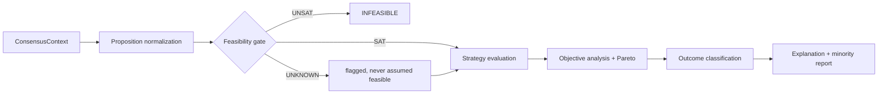

<!-- trace: FR-608 -->
# Consensus Model

**Version:** 1.0 · **Status:** implemented (Phase 9, T9-01…T9-06)
**Port:** `ConsensusStrategy`, `ConvergenceStrategy` ([PORTS.md §6](PORTS.md)) ·
**Requirements:** FR-601 … FR-609, FR-505, FR-506 ·
**ADR:** [ADR-014](adr/ADR-014-pluggable-consensus-feasibility-gate.md) ·
**Formal specs:** [consensus-formalism/](consensus-formalism/) ·
**Code:** `backend/app/domain/consensus.py`, `backend/app/ports/consensus.py`,
`backend/app/application/consensus.py` (`WeightedStrategy`, `EvidenceWeightedStrategy`,
`ConstraintAwareStrategy`, `StrategyRegistry`, `ConsensusOrchestrator`) ·
**Tests:** `backend/tests/unit/test_consensus.py` (13 cases, worked examples verbatim from
the formalism docs)

## 1. What consensus is not

Consensus in this platform is **not** voting, **not** text similarity between answers, and
**not** an LLM's judgement about whether the agents "seem to agree". Each of those is a
mechanism that produces a confident-looking number while destroying the information the
project exists to study.

Consensus is: *a deterministic, auditable computation over structured positions, evidence,
objectives and constraints that yields an outcome class, a ranking over feasible
alternatives, and an explanation that survives interrogation.*

The Orchestrator LLM may **propose** which strategy or parameters to use. The coordinator
**decides**, and the decision is an event
([ADR-013](adr/ADR-013-coordinator-vs-orchestrator-authority.md)).

## 2. Inputs

`ConsensusContext` is the complete, frozen input set. A strategy may not fetch anything else.

| Input | Source | Required |
| --- | --- | --- |
| Alternatives | `alternatives` | yes |
| Normalized propositions | `propositions` | yes |
| Agent positions + confidence + stated reasons | `agent_positions` | yes |
| Evidence with trust and verification state | `evidence` | yes |
| Assumptions and their materiality | `assumptions` | yes |
| Risks and uncertainty attachments | `risks`, `uncertainties` | yes |
| Objectives, weights, declared conflicts | `objectives` | yes |
| Constraints with modality and formal status | `constraints` | yes |
| Symbolic evaluations | `symbolic_evaluations` | when hard constraints exist |
| Simulation results | `simulation_runs` | when requested |
| Critiques and their resolution state | `critiques` | yes |
| Agent trust state | `agent_trust` | optional, must be declared |
| Strategy configuration + version | `consensus_configs` | yes |

`input_hash` over this set is stored on every `consensus_results` row. A result whose inputs
cannot be reconstructed is a defect, not a rounding error (NFR-003).

<!-- trace: FR-601 -->
## 3. Pipeline

**Stage order is fixed.** Feasibility precedes ranking in every strategy without exception
(FR-602): a high score must never buy an alternative past a violated hard constraint. A
strategy that wants to weight constraints softly must say so in its formal document and still
expose the violation.

<!-- trace: FR-604, FR-609 -->
## 4. Outcome taxonomy

| Outcome | Definition | Mandatory disclosure |
| --- | --- | --- |
| `FULL_CONSENSUS` | All active agents support one feasible alternative above the agreement threshold, no unresolved blocking critique | dissent count (may be zero), thresholds used |
| `PARTIAL_CONSENSUS` | A leading feasible alternative clears the lower threshold but not the upper, or agents abstain | who abstained, what would change the ranking |
| `CONDITIONAL_CONSENSUS` | Consensus holds only under named assumptions or parameter ranges | the condition set, and what breaks it |
| `PARETO_SET` | Conflicting objectives make a single winner indefensible; the undominated set is the answer | the frontier, and the trade-off each point represents |
| `NO_CONSENSUS` | Positions remain irreconcilable on a proposition both sides accept as well-evidenced | the disputed proposition, each side's warrant |
| `DEADLOCK` | Rounds exhausted with cyclical or strategically blocked disagreement | round history, what was tried |
| `INSUFFICIENT_EVIDENCE` | The ranking cannot be adjudicated because required evidence is absent | the specific evidence gap, who could close it |
| `INFEASIBLE` | No alternative satisfies the non-negotiable constraints | the unsat core, the conflicting constraint set |

`INFEASIBLE` outranks every other outcome. `INSUFFICIENT_EVIDENCE` is a *successful* result:
it is the platform refusing to invent an answer.

<!-- trace: FR-606 -->
## 5. Semantic disagreement

Disagreement is measured on normalized propositions, never on strings (FR-606). Two agents
whose prose differs but who assert the same proposition with the same polarity and modality
**agree**; two agents whose prose matches but whose propositions differ in quantifier scope
or validity domain **do not**.

`disagreement(proposition)` returns a vector over `{SUPPORT, OPPOSE, UNCERTAIN, ABSTAIN}`
weighted by each agent's declared confidence. The vector is what the explanation renders; a
scalar spread may be shown alongside it, labelled as a summary of the vector.

## 6. Support is not truth

The support value a strategy returns is a **social** quantity: how much the agents, given
their evidence and positions, back an alternative. Truth-likeness is a separate and usually
unavailable quantity. The two are never multiplied into one number, and every view labels the
value as support (see [EPISTEMIC_MODEL.md](EPISTEMIC_MODEL.md) §5 and P-1 in
[STRUCTURED_REASONING.md](STRUCTURED_REASONING.md)).

## 7. Strategy registry

| Strategy | Class | Status | Formal doc |
| --- | --- | --- | --- |
| `weighted` | deterministic linear aggregation | Phase 9 baseline | [weighted.md](consensus-formalism/weighted.md) |
| `evidence_weighted` | support weighted by verified evidence strength | Phase 9 | [evidence_weighted.md](consensus-formalism/evidence_weighted.md) |
| `constraint_aware` | feasibility-gated, lexicographic | Phase 9 | [constraint_aware.md](consensus-formalism/constraint_aware.md) |
| `deliberative` | position revision across rounds, judgement aggregation | research | [deliberative.md](consensus-formalism/deliberative.md) |
| `bayesian` | opinion pooling over proposition posteriors | research | [bayesian.md](consensus-formalism/bayesian.md) |
| `prediction_market` | price as an aggregation mechanism | research | [prediction_market.md](consensus-formalism/prediction_market.md) |

Selection rules:

- **S-1** A strategy is selectable only if its formal document exists and is reviewed
  (FR-608). No document, no registration.
- **S-2** The session records the strategy *and its parameter values*; defaults are recorded
  explicitly as `default`, never left implicit.
- **S-3** A session may run several strategies for comparison. Results are stored side by
  side; they are never averaged into a meta-consensus.
- **S-4** Strategies are pure functions of `ConsensusContext`. Any randomness must be seeded
  and recorded in the manifest ([REPRODUCIBILITY.md](REPRODUCIBILITY.md)).

## 8. Convergence

`ConvergenceStrategy` decides whether another round is worth running. Signals: position
movement magnitude, count of unresolved critiques, evidence gaps closed per round, budget
remaining, and oscillation detection. Convergence is a *stopping* decision: it never edits a
position and never declares agreement.

<!-- trace: FR-505, FR-506 -->
## 9. Minority report

Every result carries a minority report: each dissenting or abstaining agent, its position, its
stated warrant, the propositions it disputes, the critiques it left unresolved, and what
evidence would change its mind. The report is part of the recommendation object, not an
attachment, and no API path omits it (FR-505, FR-506).

<!-- trace: FR-603, FR-605 -->
## 10. Invariants

- **C-1** Feasibility before ranking, always.
- **C-2** Every outcome class is reachable. A strategy that can only emit `FULL_CONSENSUS` or
  `NO_CONSENSUS` is inadmissible.
- **C-3** `explain(result)` is total: it never raises, never returns empty, and reproduces the
  number from the recorded trace.
- **C-4** No agent's position may be dropped, imputed or altered by the consensus layer.
- **C-5** Confidence reported by an agent is used only as declared; it is never rescaled into
  a probability ([EPISTEMIC_MODEL.md](EPISTEMIC_MODEL.md) §4).
- **C-6** An unresolved blocking critique caps the outcome at `PARTIAL_CONSENSUS`, whatever
  the arithmetic says.
- **C-7** Same `input_hash` + same strategy version + same parameters MUST produce a
  byte-identical result (NFR-003).
- **C-8** Solver `UNKNOWN` on a hard constraint is treated as *unresolved*, never as satisfied or
  violated (FR-708). It remains visible in the feasibility trace and, if selected by non-symbolic inputs,
  forces at most `CONDITIONAL_CONSENSUS`; the result does not constitute positive symbolic assurance.

## 11. Failure modes

| Failure | Detection | Reaction |
| --- | --- | --- |
| Strategy crash | exception in activity | `CONSENSUS_FAILED` event; no outcome is substituted; human decides |
| Degenerate input (one alternative, one agent) | input census | result emitted with `degenerate_input: true` and a warning in the explanation |
| Threshold gaming | sensitivity sweep at commit time | explanation reports how far inputs could move before the ranking flips |
| Silent suppression of dissent | API test on every write path | build failure (FR-506) |
| Support read as truth | UI review against the P-1 checklist | phase gate failure |
| Strategy chosen to favour a preferred answer | experiment comparison + audit query on strategy changes | flagged in [AUDITABILITY.md](AUDITABILITY.md) |

## 12. Overridden outcomes

A human override is permitted (FR-801) and is recorded as an `OVERRIDE` event with actor,
reason and the original result. The original consensus result is never rewritten: the
recommendation object carries both, and every downstream view labels the override (FR-803).

## 13. Related

[REASONING_GRAPH.md](REASONING_GRAPH.md) (`YIELDS`, `SCORED_BY`) ·
[EXPLAINABILITY.md](EXPLAINABILITY.md) · [METRICS.md](METRICS.md) ·
[DATA_MODEL.md §7](DATA_MODEL.md) · [API.md](API.md)

