# Data Model

**Version:** 1.5 · **Status:** Phase 1–7 through T7-07 schema subset implemented
**Engine:** PostgreSQL 16 + `pgvector` · **ORM:** SQLAlchemy 2.x · **Migrations:** Alembic
**Authority:** PostgreSQL is the only system-of-record
([ADR-001](adr/ADR-001-postgres-source-of-truth.md)).

## 1. Modelling conventions

| Concern | Rule |
| --- | --- |
| Identity | `id UUID PRIMARY KEY` holding **uuidv7** (time-ordered, index-friendly). Generated in application code, never by the DB |
| External ids | opaque prefixed strings at the API boundary (`sesn_…`, `clm_…`); the UUID never leaves the backend |
| Tenancy | every tenant-owned table carries `workspace_id UUID NOT NULL REFERENCES workspaces(id)` and is guarded by RLS plus an application check |
| Time | `TIMESTAMPTZ`, always UTC; `created_at`, `updated_at` on mutable tables; `recorded_at` for facts about the world |
| Soft state | `status TEXT NOT NULL` with a CHECK enumerating allowed values; **no physical DELETE** on reasoning artifacts |
| Versioning | `version INTEGER NOT NULL DEFAULT 1` plus `supersedes UUID NULL`; unique `(logical_id, version)` |
| Contract version | `schema_version INTEGER NOT NULL DEFAULT 1` — distinct from entity `version` |
| Enums | `TEXT` + CHECK, never native Postgres enums (adding a value must not require a type rewrite) |
| JSON | `JSONB` for genuinely open structures only (`metadata`, `payload`); anything queried MUST be a column |
| Measures | `NUMERIC`, never float; unit stored alongside the value |
| Probabilities | `NUMERIC(6,5)` with CHECK in `[0,1]` |
| Hashes | `TEXT` with algorithm prefix (`sha256:…`) so algorithms can migrate |
| Deletes | `ON DELETE RESTRICT` by default; cascade only for owned derived rows |
| Naming | `snake_case`; tables plural, columns singular; `ix_`, `uq_`, `ck_`, `trg_` prefixes |
| Large payloads | bytes live in MinIO; the row stores `object_ref`, `content_hash`, `size_bytes`, `media_type` |
| Embeddings | `vector(1536)` in derived `vector_items`; UUID references resolve to authoritative knowledge rows and the store stays swappable behind its port |

**Standard columns on every tenant-owned table** (shown once, omitted below):

```sql
id              UUID PRIMARY KEY,
workspace_id    UUID NOT NULL REFERENCES workspaces(id) ON DELETE RESTRICT,
created_at      TIMESTAMPTZ NOT NULL DEFAULT now(),
updated_at      TIMESTAMPTZ NOT NULL DEFAULT now(),
schema_version  INTEGER NOT NULL DEFAULT 1
```

## 2. Entity relationship overview

```mermaid
erDiagram
    WORKSPACES ||--o{ USERS : membership
    WORKSPACES ||--o{ AGENT_DEFINITIONS : owns
    WORKSPACES ||--o{ LLM_CONFIGURATIONS : owns
    WORKSPACES ||--o{ SESSIONS : owns
    SESSIONS ||--o{ SESSION_AGENTS : participates
    AGENT_DEFINITIONS ||--o{ SESSION_AGENTS : instantiates
    SESSIONS ||--o{ SESSION_AGENT_INTERVENTIONS : changes_membership
    AGENT_DEFINITIONS ||--o{ SESSION_AGENT_INTERVENTIONS : effective_definition
    SESSIONS ||--o{ PROBLEMS : frames
    PROBLEMS ||--o{ PROPOSITIONS : decomposes_into
    SESSIONS ||--o{ CLAIMS : produces
    CLAIMS ||--o{ PROPOSITIONS : normalized_as
    CLAIMS ||--o{ EVIDENCE : supported_by
    SOURCES ||--o{ EVIDENCE : originates
    DOCUMENTS ||--o{ CHUNKS : split_into
    CHUNKS ||--o{ EVIDENCE : cites
    CHUNKS ||--o| VECTOR_ITEMS : indexed_by
    SESSIONS ||--o{ OBJECTIVES : commits_to
    SESSIONS ||--o{ CONSTRAINTS : commits_to
    SESSIONS ||--o{ ALTERNATIVES : considers
    SESSIONS ||--o{ RISKS : identifies
    SESSIONS ||--o{ ASSUMPTIONS : states
    SESSIONS ||--o{ INFERENCES : derives
    CLAIMS ||--o{ CRITIQUES : targeted
    SESSION_AGENTS ||--o{ AGENT_POSITIONS : takes
    ALTERNATIVES ||--o{ ALTERNATIVE_SCORES : scored_as
    SESSIONS ||--o{ CONSENSUS_RESULTS : concludes
    CONSENSUS_RESULTS ||--o{ CONSENSUS_EXPLANATIONS : explained_by
    CONSENSUS_RESULTS ||--o{ RECOMMENDATIONS : yields
    SESSIONS ||--o{ SIMULATION_RUNS : exercises
    SIMULATION_RUNS ||--o{ SIMULATION_RESULTS : produces
    FORMALIZATIONS ||--o{ SYMBOLIC_EVALUATIONS : evaluated_as
    SESSIONS ||--o{ REASONING_EVENTS : recorded_in
    GRAPH_NODES ||--o{ GRAPH_EDGES : from_node
    GRAPH_NODES ||--o{ GRAPH_EDGES : to_node
    SESSIONS ||--o{ METRIC_VALUES : measured_by
    EXPERIMENTS ||--o{ EXPERIMENT_RUNS : repeats
    SESSIONS ||--o{ AUDIT_RECORDS : audited_by
    SESSIONS ||--o{ ACCESS_LOG : access_logged
    SESSIONS ||--o{ AUDIT_ANCHORS : anchored_by
    SESSIONS ||--o{ REPRODUCIBILITY_MANIFESTS : pinned_by
    KNOWLEDGE_NAMESPACES ||--o{ SEMANTIC_MEMORY_ENTRIES : contains
```



## 3. Identity, tenancy and configuration

```sql
CREATE TABLE users (
  id            UUID PRIMARY KEY,
  oidc_issuer   TEXT NOT NULL,
  oidc_subject  TEXT NOT NULL,
  email         VARCHAR(320),
  display_name  VARCHAR(255) NOT NULL,
  is_active     BOOLEAN NOT NULL DEFAULT true,
  created_at    TIMESTAMPTZ NOT NULL DEFAULT now(),
  updated_at    TIMESTAMPTZ NOT NULL DEFAULT now(),
  last_seen_at  TIMESTAMPTZ,
  UNIQUE (oidc_issuer, oidc_subject)
);

CREATE TABLE workspaces (
  id         UUID PRIMARY KEY,
  slug       VARCHAR(100) NOT NULL UNIQUE,
  name       VARCHAR(255) NOT NULL,
  created_at TIMESTAMPTZ NOT NULL DEFAULT now(),
  updated_at TIMESTAMPTZ NOT NULL DEFAULT now()
);

CREATE TYPE workspace_role AS ENUM ('ADMIN', 'RESEARCHER', 'OPERATOR', 'VIEWER');

CREATE TABLE workspace_members (
  workspace_id UUID NOT NULL REFERENCES workspaces(id) ON DELETE CASCADE,
  user_id      UUID NOT NULL REFERENCES users(id) ON DELETE CASCADE,
  role         workspace_role NOT NULL,
  joined_at    TIMESTAMPTZ NOT NULL DEFAULT now(),
  PRIMARY KEY (workspace_id, user_id)
);

ALTER TABLE workspace_members ENABLE ROW LEVEL SECURITY;
ALTER TABLE workspace_members FORCE ROW LEVEL SECURITY;
```

`workspace_members.role` is the only workspace authority in Phase 1. There is no platform role and
no special owner role; ownership privileges, where needed, are represented by an `ADMIN` membership.
Users are projections of external identities, so this schema deliberately contains no password.
Every membership query is tenant-scoped by the same `app.workspace_id` RLS context as other
workspace-owned data.

```sql

-- secret material is NEVER stored here; only a SecretRef path
CREATE TABLE llm_configurations (
  id              UUID PRIMARY KEY,
  workspace_id    UUID NOT NULL REFERENCES workspaces(id),
  name            TEXT NOT NULL,
  provider_kind   TEXT NOT NULL CHECK (provider_kind IN ('openai_compatible','mock')),
  base_url        TEXT NOT NULL,
  model           TEXT NOT NULL,
  embedding_model TEXT,
  api_version     TEXT,
  secret_ref      TEXT NOT NULL,            -- docker://crp_llm_key | env://LLM_API_KEY
  capabilities    JSONB NOT NULL DEFAULT '{}',
  rate_limit      JSONB NOT NULL DEFAULT '{}',
  is_active       BOOLEAN NOT NULL DEFAULT true,
  created_at      TIMESTAMPTZ NOT NULL DEFAULT now(),
  updated_at      TIMESTAMPTZ NOT NULL DEFAULT now(),
  UNIQUE (workspace_id, name)
);
```

## 4. Agent registry

```sql
-- logical_id groups versions; a referenced version is immutable
CREATE TABLE agent_definitions (
  id             UUID PRIMARY KEY,
  workspace_id   UUID NOT NULL REFERENCES workspaces(id),
  logical_id     UUID NOT NULL,
  version        INTEGER NOT NULL DEFAULT 1,
  name           TEXT NOT NULL,
  domain         TEXT NOT NULL,             -- fiscal | macroeconomic | social_policy | …
  role_kind      TEXT NOT NULL CHECK (role_kind IN
                   ('domain_expert','critic','orchestrator','retriever','evaluator')),
  objectives     JSONB NOT NULL DEFAULT '[]',
  constraints    JSONB NOT NULL DEFAULT '[]',
  knowledge_ns   UUID[] NOT NULL DEFAULT '{}',
  strategy_ref   TEXT NOT NULL,             -- ReasoningStrategy name
  strategy_ver   TEXT NOT NULL,
  prompt_ref     TEXT NOT NULL,             -- ObjectStore key of the prompt template
  prompt_hash    TEXT NOT NULL,             -- sha256:…
  llm_config_id  UUID REFERENCES llm_configurations(id),
  tool_perms     JSONB NOT NULL DEFAULT '[]',
  budget         JSONB NOT NULL DEFAULT '{}',
  status         TEXT NOT NULL DEFAULT 'DRAFT' CHECK (status IN
                   ('DRAFT','ACTIVE','DEPRECATED','WITHDRAWN')),
  referenced_at  TIMESTAMPTZ,               -- set on first use → freezes the row
  created_at     TIMESTAMPTZ NOT NULL DEFAULT now(),
  updated_at     TIMESTAMPTZ NOT NULL DEFAULT now(),
  UNIQUE (logical_id, version),
  UNIQUE (workspace_id, name, version)
);
CREATE INDEX ix_agentdef_lookup
  ON agent_definitions (workspace_id, domain, status);
```

`referenced_at` enforces FR-202: trigger `trg_agentdef_immutable` rejects any `UPDATE` on
a row whose `referenced_at IS NOT NULL`, except for `status` and `updated_at`.

<!-- trace: FR-102 -->
## 5. Sessions and Phase 3 binding

Phase 3 creates a fully bound `DRAFT`; it does not start Temporal. Phase 4 adds workflow identifiers
and expands the session state machine. Objective and constraint sets are the
artifact ids in `session_objectives` and `session_constraints`, not nullable pseudo-set ids.

```sql
CREATE TABLE sessions (
  id UUID PRIMARY KEY,
  workspace_id UUID NOT NULL REFERENCES workspaces(id),
  status TEXT NOT NULL DEFAULT 'DRAFT' CHECK (status = 'DRAFT'),
  problem_statement TEXT NOT NULL CHECK (length(btrim(problem_statement)) > 0),
  max_rounds INTEGER NOT NULL CHECK (max_rounds BETWEEN 1 AND 50),
  budget_tokens BIGINT NOT NULL CHECK (budget_tokens > 0),
  budget_usd NUMERIC(12,2) NOT NULL CHECK (budget_usd > 0),
  deadline_at TIMESTAMPTZ,
  round INTEGER NOT NULL DEFAULT 0 CHECK (round >= 0),
  created_by UUID NOT NULL,
  created_at TIMESTAMPTZ NOT NULL DEFAULT now(),
  updated_at TIMESTAMPTZ NOT NULL DEFAULT now(),
  UNIQUE (workspace_id, id),
  FOREIGN KEY (workspace_id, created_by)
    REFERENCES workspace_members(workspace_id, user_id)
);

CREATE TABLE session_agents (
  workspace_id UUID NOT NULL,
  session_id UUID NOT NULL,
  agent_def_id UUID NOT NULL,
  bound_at TIMESTAMPTZ NOT NULL DEFAULT now(),
  PRIMARY KEY (session_id, agent_def_id),
  FOREIGN KEY (workspace_id, session_id) REFERENCES sessions(workspace_id, id),
  FOREIGN KEY (agent_def_id, workspace_id)
    REFERENCES agent_definitions(id, workspace_id)
);
```

`session_objectives` and `session_constraints` are created after `reasoning_artifacts`; each has
`workspace_id`, `session_id`, `artifact_id`, a composite primary key on `(session_id, artifact_id)`,
a tenant-safe session FK, and a tenant-safe artifact FK. A deferred constraint trigger rejects a
binding unless its artifact kind is respectively `OBJECTIVE` or `CONSTRAINT`. The request contains
inline objective and constraint artifact inputs so the session and its artifacts can be inserted in
one transaction; clients never pre-create orphan artifacts. Session creation,
problem statement, all bindings, budget, ledger head and `SESSION_CREATED` event commit atomically.
At least one agent and objective is required; the required constraint array may be empty. Agent rows set
`agent_definitions.referenced_at` on first binding.

**State ownership.** The PostgreSQL session lifecycle projection is authoritative. Temporal owns
execution state only after Phase 4 attaches a workflow. A mismatch after attachment is an error,
never dual authority
([ADR-003](adr/ADR-003-temporal-durable-workflow.md)).

Phase 4 preserves the frozen Phase 3 binding row and adds `session_lifecycles` as the mutable,
authoritative projection keyed by `(workspace_id, session_id)`. It stores the complete coordinator
state, round, Temporal workflow/run identity, the last transition event id, and initialized/started/
terminal timestamps. Every transition locks this row and appends its reasoning-ledger event in the
same PostgreSQL transaction. The projection uses forced workspace RLS; Temporal visibility remains
diagnostic and never overwrites it.

T6-08 adds append-only `session_agent_interventions`. Each row has the ledger `event_id`, workspace/session,
`REPLACE | INJECT`, optional replaced definition, new definition, `effective_round`, human actor,
correlation, reason and UTC record time. Composite foreign keys preserve tenant/session/event identity;
forced RLS and an update/delete rejection trigger protect history. `session_agents` remains the initial
pin set. Effective membership applies interventions by `(effective_round, reasoning_events.ledger_seq)`.
The membership mutation transaction takes a session advisory lock and locks `session_lifecycles`, closing
the race with round start. Session ceilings remain typed `sessions.budget_tokens/budget_usd`; per-agent
ceilings use exact JSON keys `max_tokens` and `max_cost_usd`; usage is summed from `llm_call_records`.

<!-- trace: FR-302, FR-303, FR-307, FR-308, FR-310, FR-312 -->
## 6. Reasoning artifacts

### 6.0 Phase 3 normative contract

This subsection is the complete Phase 3 artifact storage contract.
T3-03 implements one `reasoning_artifacts` table with a strict discriminator and JSONB `payload`;
kind-specific validation is enforced in domain construction plus database CHECK functions. Splitting
kinds into tables later requires an ADR and does not change the public contract.

```sql
CREATE TABLE reasoning_artifacts (
  id UUID PRIMARY KEY,
  workspace_id UUID NOT NULL,
  session_id UUID NOT NULL,
  logical_id UUID NOT NULL,
  kind TEXT NOT NULL CHECK (kind IN
    ('CLAIM','FACT','ASSUMPTION','INFERENCE','PROPOSITION','EVIDENCE','UNCERTAINTY',
     'RISK','IMPACT','OBJECTIVE','CONSTRAINT','ALTERNATIVE','POSITION','CRITIQUE')),
  schema_version INTEGER NOT NULL DEFAULT 1 CHECK (schema_version > 0),
  version INTEGER NOT NULL DEFAULT 1 CHECK (version > 0),
  status TEXT NOT NULL DEFAULT 'ACTIVE'
    CHECK (status IN ('ACTIVE','SUPERSEDED','WITHDRAWN')),
  supersedes_id UUID,
  owner_actor_class TEXT NOT NULL
    CHECK (owner_actor_class IN ('HUMAN','AGENT','SERVICE','POLICY')),
  owner_actor_id UUID NOT NULL,
  round INTEGER NOT NULL DEFAULT 0 CHECK (round >= 0),
  payload JSONB NOT NULL,
  provenance JSONB NOT NULL,
  source_references JSONB NOT NULL DEFAULT '[]',
  parent_relationships JSONB NOT NULL DEFAULT '[]',
  confidence JSONB,
  metadata JSONB NOT NULL DEFAULT '{}',
  content_hash TEXT NOT NULL CHECK (content_hash ~ '^sha256:[0-9a-f]{64}$'),
  created_at TIMESTAMPTZ NOT NULL,
  updated_at TIMESTAMPTZ NOT NULL,
  UNIQUE (workspace_id, id),
  UNIQUE (workspace_id, session_id, id),
  UNIQUE (workspace_id, session_id, logical_id, version),
  FOREIGN KEY (workspace_id, session_id) REFERENCES sessions(workspace_id, id),
  FOREIGN KEY (workspace_id, session_id, supersedes_id)
    REFERENCES reasoning_artifacts(workspace_id, session_id, id),
  CHECK ((version = 1 AND supersedes_id IS NULL) OR
         (version > 1 AND supersedes_id IS NOT NULL))
);

CREATE TABLE session_objectives (
  workspace_id UUID NOT NULL,
  session_id UUID NOT NULL,
  artifact_id UUID NOT NULL,
  PRIMARY KEY (session_id, artifact_id),
  FOREIGN KEY (workspace_id, session_id) REFERENCES sessions(workspace_id, id),
  FOREIGN KEY (workspace_id, session_id, artifact_id)
    REFERENCES reasoning_artifacts(workspace_id, session_id, id)
);
CREATE TABLE session_constraints (
  workspace_id UUID NOT NULL,
  session_id UUID NOT NULL,
  artifact_id UUID NOT NULL,
  PRIMARY KEY (session_id, artifact_id),
  FOREIGN KEY (workspace_id, session_id) REFERENCES sessions(workspace_id, id),
  FOREIGN KEY (workspace_id, session_id, artifact_id)
    REFERENCES reasoning_artifacts(workspace_id, session_id, id)
);
-- T3-03 installs deferred kind-check triggers on both binding tables.
```

Lifecycle status is not epistemic status. Review values such as `UNVERIFIED`, `CONTESTED` or
`SOURCE_VERIFIED` live in the relevant typed payload. Revision inserts a new row, changes the old
row only from `ACTIVE` to `SUPERSEDED`, and adds a `SUPERSEDES` graph edge. Withdrawal changes only
`ACTIVE` to `WITHDRAWN` and records an event. Content columns never update in place.

`FACT` is first-class. Its payload requires statement, verification, source reference, locator,
retrieval time and source content hash. `EVIDENCE` uses the same opaque provenance primitives plus
relation, quote, trust and weight. Source/document/chunk tables belong to Phase 5; Phase 3 stores no
foreign key to them. Opinion is `POSITION`; hypothesis is `CLAIM` with `claim_type=HYPOTHESIS`.

`content_hash` is `sha256:` plus the lowercase SHA-256 digest of UTF-8 RFC 8785 JCS over an object
containing exactly these immutable keys: `workspace_id`, `session_id`, `logical_id`, `kind`,
`schema_version`, `version`, `supersedes_id`, `owner_actor_class`, `owner_actor_id`, `round`, `payload`,
`provenance`, `source_references`, `parent_relationships`, `confidence`, `metadata`. Nullable values
remain JSON `null`; UUIDs are lowercase canonical text. Row `id`, lifecycle `status` and timestamps are
excluded so an allowed lifecycle transition does not alter content identity.

`provenance` is a closed object with required `origin` in `HUMAN`, `LLM`, `RETRIEVAL`, `TOOL`,
`SIMULATION`, `SYMBOLIC`, `IMPORT`, `HISTORICAL_SESSION` and required non-empty `reference`; it may
also carry `model_call_id` or `activity_id`. `source_references` is an array of closed objects with
required non-empty `reference`, object `locator`, `content_hash` matching `sha256:…`, and RFC 3339
`retrieved_at`; `source_timestamp` is optional. These values are opaque in Phase 3. `FACT` and
`EVIDENCE` require at least one source reference; no other kind may claim source verification merely
from non-empty provenance. `POLICY` may emit ledger events but may not own content artifacts.

`parent_relationships` contains closed `{edge_type, target_artifact_id}` objects and is the durable
input to graph projection. `confidence`, when present, is a closed object with `kind`, decimal-string
`value` in `[0,1]`, non-empty `meaning`, and `basis_artifact_ids`; a bare number is invalid.
All non-integer quantitative payload values are canonical decimal strings, never JSON binary floats;
domain validators normalize trailing zeroes and reject exponent notation before JCS hashing.

### 6.1 Kind payload contract

Every payload is a closed object (`additionalProperties = false` in API/domain schemas). Shared
references are artifact ids in the same workspace and session. Required fields are:

| Kind | Required payload fields |
| --- | --- |
| `CLAIM` | `statement`, `claim_type` (`FACTUAL`, `CAUSAL`, `PREDICTIVE`, `EVALUATIVE`, `PROCEDURAL`, `HYPOTHESIS`), `direction` (`SUPPORTS`, `OPPOSES`), `strength` (`WEAK`, `MODERATE`, `STRONG`, `DECISIVE`), `supporting_evidence_ids`, `opposing_evidence_ids`, `review_status` (`PROPOSED`, `ACCEPTED`, `CONTESTED`, `REJECTED`) |
| `FACT` | `statement`, `verification` (`SOURCE_VERIFIED`, `CROSS_CHECKED`); envelope `source_references` must be non-empty |
| `ASSUMPTION` | `statement`, `basis`, `materiality`, `challengeable` |
| `INFERENCE` | `premise_ids`, `conclusion_id`, `rule_kind`, `rule_text`, `validity` |
| `PROPOSITION` | `statement_original`, `statement_normalized`, `canonicalizer_version`, `proposition_kind`, `modality`, `normalization_status` |
| `EVIDENCE` | `claim_id`, `relation` (`SUPPORTS`, `OPPOSES`, `QUALIFIES`), `quote`, `verification` (`UNVERIFIED`, `SOURCE_VERIFIED`, `CROSS_CHECKED`, `DISPUTED`, `REJECTED`), `trust_level` (`PRIMARY`, `AUTHORITATIVE`, `SECONDARY`, `COMMERCIAL`, `UNATTRIBUTED`, `SYNTHETIC`), decimal-string `weight` in `[0,1]`, `provenance_kind` (`RETRIEVAL`, `TOOL`, `SIMULATION`, `SYMBOLIC`, `HUMAN`, `IMPORT`) |
| `UNCERTAINTY` | `target_id`, `uncertainty_type` (`EPISTEMIC`, `ALEATORIC`, `MODEL`, `MEASUREMENT`, `SEMANTIC`, `STRATEGIC`), `representation` (`INTERVAL`, `DISTRIBUTION`, `SCENARIOS`, `QUALITATIVE`), `drivers`; representation-specific values required |
| `RISK` | `statement`, `probability`, `impact`, `uncertainty_id`, `affected_objective_ids` |
| `IMPACT` | `alternative_id`, `objective_id`, decimal-string `magnitude`, `unit`, `timeframe`, `source_artifact_id` |
| `OBJECTIVE` | `name`, `objective_type`, `direction`, `weight`, `weight_rationale`, `time_horizon`, `conflicts_with_ids` |
| `CONSTRAINT` | `name`, `statement`, `constraint_type` (`HARD`, `SOFT`, `NON_NEGOTIABLE`), `category`, `evaluation_expression`, legacy payload `formal_status` (not authoritative; T11 uses derived `validation_status`) |
| `ALTERNATIVE` | `name`, `summary`, `components`, `origin`, `feasibility_status` |
| `POSITION` | `target_id`, `stance` (`SUPPORT`, `OPPOSE`, `CONDITIONALLY_SUPPORT`, `ABSTAIN`, `INSUFFICIENT_EVIDENCE`), `rationale`, `evidence_ids`, `conditions`; common `confidence` required |
| `CRITIQUE` | `target_id`, `critique_type` (FR-501 values), `severity` (`LOW`, `MEDIUM`, `HIGH`, `BLOCKING`), `argument`, `resolution` (`OPEN`, `RESOLVED`, `UNRESOLVED`, `DISPUTED`) |

`CLAIM.supporting_evidence_ids` and `opposing_evidence_ids` are always present, possibly empty;
`unsupported` is derived as both lists empty and is exposed by the API. Objective conflict links are
symmetric at validation time. Constraint expressions are parsed into the declared machine-evaluable
formal language; prose alone fails construction. Kind details and allowed enum values are defined in
[STRUCTURED_REASONING.md](STRUCTURED_REASONING.md).

Database validation functions reject malformed closed payloads, cross-session references, forbidden
owners, and values outside these enums/ranges. Domain validation is the earlier error boundary; the
database checks are authoritative defense in depth.

### 6.2 Phase 7 Critique response persistence

Migration `20260907_0019` adds append-only, forced-RLS `critique_response_requests` and
`critique_response_results`. A request is keyed by caller-supplied `response_id` and indexes the pinned
workspace/session, turn, responding definition/version, Critique id/version, target id/version and
disposition. Its JSON objects retain the complete strict proposal and execution attribution, protected by a
canonical SHA-256 request hash. A result records the exact status/resolution mapping, Critique successor,
optional target successor, response event and commit time. Composite foreign keys keep every artifact and
event in the same tenant session; database checks enforce the seven disposition outcomes and require a target
successor exactly for `REVISE`.

Response processing locks both pinned heads and appends new rows; it never updates response history or
artifact content. The existing artifact lifecycle transition marks predecessor rows `SUPERSEDED`. The graph
endpoint policy now permits a coordinator-derived `RESPONDS_TO` edge from any of the 14 artifact kinds to a
`CRITIQUE`, because every kind can be revised; ordinary agent creation policy remains unchanged and still
forbids direct `FACT` or `EVIDENCE` creation.

## 7. Consensus and recommendation

**Post-Phase-3 design sketch.** Phase 9 owns these tables. Names here do not extend the frozen
Phase 3 entity set or authorize T3-03 migrations.

```sql
CREATE TABLE alternative_scores (
  id             UUID PRIMARY KEY,
  workspace_id   UUID NOT NULL REFERENCES workspaces(id),
  session_id     UUID NOT NULL REFERENCES sessions(id),
  alternative_id UUID NOT NULL REFERENCES alternatives(id),
  objective_id   UUID NOT NULL REFERENCES objectives(id),
  raw_value      NUMERIC(12,4),
  normalized     NUMERIC(6,5) CHECK (normalized BETWEEN 0 AND 1),
  uncertainty    JSONB,
  source         TEXT NOT NULL CHECK (source IN
                   ('agent','simulation','symbolic','human','retrieved')),
  source_id      UUID,
  created_at     TIMESTAMPTZ NOT NULL DEFAULT now(),
  UNIQUE (alternative_id, objective_id, source, source_id)
);

CREATE TABLE consensus_results (
  id                    UUID PRIMARY KEY,
  workspace_id          UUID NOT NULL REFERENCES workspaces(id),
  session_id            UUID NOT NULL REFERENCES sessions(id),
  round                 INTEGER NOT NULL,
  strategy              TEXT NOT NULL,
  strategy_version      TEXT NOT NULL,
  outcome               TEXT NOT NULL CHECK (outcome IN
                          ('FULL_CONSENSUS','PARTIAL_CONSENSUS',
                           'CONDITIONAL_CONSENSUS','PARETO_SET','NO_CONSENSUS',
                           'DEADLOCK','INSUFFICIENT_EVIDENCE','INFEASIBLE')),
  selected_alternative_id UUID REFERENCES alternatives(id),
  pareto_set            UUID[] NOT NULL DEFAULT '{}',
  support               NUMERIC(6,5) CHECK (support BETWEEN 0 AND 1),
  dissent               NUMERIC(6,5) CHECK (dissent BETWEEN 0 AND 1),
  abstention            NUMERIC(6,5) CHECK (abstention BETWEEN 0 AND 1),
  coverage              NUMERIC(6,5) CHECK (coverage BETWEEN 0 AND 1),
  constraint_report     JSONB NOT NULL,   -- per-constraint verdicts incl. UNKNOWN
  conditions            JSONB NOT NULL DEFAULT '[]',
  input_hash            TEXT NOT NULL,    -- sha256 of the canonical input set
  created_at            TIMESTAMPTZ NOT NULL DEFAULT now(),
  ck_selection_feasible CHECK (           -- FR-603
      selected_alternative_id IS NULL
      OR outcome IN ('FULL_CONSENSUS','PARTIAL_CONSENSUS','CONDITIONAL_CONSENSUS')),
  UNIQUE (session_id, round, strategy, strategy_version)
);

CREATE TABLE consensus_explanations (
  id              UUID PRIMARY KEY,
  workspace_id    UUID NOT NULL REFERENCES workspaces(id),
  consensus_id    UUID NOT NULL REFERENCES consensus_results(id) ON DELETE CASCADE,
  formula         TEXT NOT NULL,
  weights         JSONB NOT NULL,
  thresholds      JSONB NOT NULL,
  contributions   JSONB NOT NULL,   -- per agent: position, weight, evidence strength
  derivation      JSONB NOT NULL,   -- ordered steps, machine readable
  caveats         JSONB NOT NULL DEFAULT '[]',
  minority_report JSONB NOT NULL DEFAULT '[]',
  created_at      TIMESTAMPTZ NOT NULL DEFAULT now(),
  UNIQUE (consensus_id)
);

CREATE TABLE recommendations (
  id             UUID PRIMARY KEY,
  workspace_id   UUID NOT NULL REFERENCES workspaces(id),
  session_id     UUID NOT NULL REFERENCES sessions(id),
  consensus_id   UUID NOT NULL REFERENCES consensus_results(id),
  alternative_id UUID REFERENCES alternatives(id),
  rank           INTEGER NOT NULL,
  title          TEXT NOT NULL,
  statement      TEXT NOT NULL,
  conditions     JSONB NOT NULL DEFAULT '[]',
  risks          UUID[] NOT NULL DEFAULT '{}',
  open_questions JSONB NOT NULL DEFAULT '[]',
  is_override    BOOLEAN NOT NULL DEFAULT false,
  override_by    UUID REFERENCES users(id),
  override_reason TEXT,
  created_at     TIMESTAMPTZ NOT NULL DEFAULT now(),
  ck_override_labelled CHECK (is_override OR override_by IS NULL),
  UNIQUE (consensus_id, rank)
);
```

## 8. Knowledge, sources and retrieval

**Phase 5 frozen logical contract.** Migrations may add physical columns and indexes but must preserve
these ownership rules. Every tenant-owned parent exposes `UNIQUE (workspace_id, id)` and every
tenant-owned child uses a composite `(workspace_id, parent_id)` foreign key. Every tenant table has
forced RLS. Phase 3 opaque provenance remains valid; Phase 5 citations add resolvable foreign keys
without rewriting old artifacts.

Namespace access uses a separate `knowledge_namespace_grants` relation with subject kind/id,
capability and validity interval. `GLOBAL` namespaces are not RLS exceptions: each workspace receives
an explicit read grant. Source object identity, document parse version and chunk content identity are
immutable; processing status and retraction state change through audited transitions. Existing
`vector_items` is an adapter index, not source authority; Phase 5 replaces free-form provenance with
UUID-backed references while preserving `VectorStore` port behavior.

```sql
CREATE TABLE knowledge_namespaces (
  id           UUID PRIMARY KEY,
  workspace_id UUID NOT NULL REFERENCES workspaces(id),
  tier         TEXT NOT NULL CHECK (tier IN
                 ('GLOBAL','WORKSPACE','DOMAIN','AGENT','SESSION','HISTORICAL')),
  name         TEXT NOT NULL,
  session_id   UUID,
  agent_def_id UUID,
  retention    JSONB NOT NULL DEFAULT '{}',
  created_at   TIMESTAMPTZ NOT NULL DEFAULT now(),
  UNIQUE (workspace_id, id),
  UNIQUE (workspace_id, tier, name),
  FOREIGN KEY (workspace_id, session_id) REFERENCES sessions(workspace_id, id),
  FOREIGN KEY (agent_def_id, workspace_id)
    REFERENCES agent_definitions(id, workspace_id)
);

CREATE TABLE knowledge_namespace_grants (
  id           UUID PRIMARY KEY,
  workspace_id UUID NOT NULL,
  namespace_id UUID NOT NULL,
  subject_kind TEXT NOT NULL CHECK (subject_kind IN
                 ('WORKSPACE','USER','AGENT_DEFINITION','SESSION')),
  subject_id   UUID NOT NULL,
  capability   TEXT NOT NULL CHECK (capability IN ('READ','WRITE')),
  valid_from   TIMESTAMPTZ NOT NULL,
  valid_until  TIMESTAMPTZ,
  created_at   TIMESTAMPTZ NOT NULL DEFAULT now(),
  FOREIGN KEY (workspace_id, namespace_id)
    REFERENCES knowledge_namespaces(workspace_id, id),
  CHECK (valid_until IS NULL OR valid_until > valid_from)
);

CREATE TABLE sources (
  id            UUID PRIMARY KEY,
  workspace_id  UUID NOT NULL REFERENCES workspaces(id),
  namespace_id  UUID NOT NULL,
  title         TEXT NOT NULL,
  citation      TEXT NOT NULL,
  publisher     TEXT,
  url           TEXT,
  object_ref    TEXT NOT NULL,      -- minio://bucket/key
  content_hash  TEXT NOT NULL,
  media_type    TEXT NOT NULL,
  size_bytes    BIGINT NOT NULL,
  published_at  TIMESTAMPTZ,        -- when the source speaks about the world
  ingested_at   TIMESTAMPTZ NOT NULL DEFAULT now(),
  trust_level   TEXT NOT NULL DEFAULT 'UNKNOWN',
  license       TEXT,
  status        TEXT NOT NULL DEFAULT 'READY' CHECK (status IN
                  ('PROCESSING','READY','FAILED','RETRACTED')),
  retracted_at  TIMESTAMPTZ,
  retraction_reason TEXT,
  uploaded_by   UUID,
  ck_retraction CHECK ((status = 'RETRACTED') = (retracted_at IS NOT NULL)),
  CHECK (status <> 'RETRACTED' OR length(btrim(retraction_reason)) > 0),
  FOREIGN KEY (workspace_id, namespace_id)
    REFERENCES knowledge_namespaces(workspace_id, id),
  FOREIGN KEY (uploaded_by, workspace_id)
    REFERENCES workspace_members(user_id, workspace_id)
);

CREATE TABLE documents (
  id           UUID PRIMARY KEY,
  workspace_id UUID NOT NULL REFERENCES workspaces(id),
  source_id    UUID NOT NULL,
  parent_id    UUID,  -- for split/merged docs
  title        TEXT,
  language     TEXT NOT NULL DEFAULT 'und',
  structure    JSONB NOT NULL DEFAULT '{}',    -- headings, tables, pages
  page_count   INTEGER,
  char_count   INTEGER,
  parser       TEXT NOT NULL,
  parser_version TEXT NOT NULL,
  status       TEXT NOT NULL DEFAULT 'PENDING' CHECK (status IN
                 ('PENDING','PARSING','CHUNKED','EMBEDDED','READY','FAILED')),
  error        TEXT,
  created_at   TIMESTAMPTZ NOT NULL DEFAULT now(),
  updated_at   TIMESTAMPTZ NOT NULL DEFAULT now(),
  UNIQUE (workspace_id, id),
  FOREIGN KEY (workspace_id, source_id) REFERENCES sources(workspace_id, id),
  FOREIGN KEY (workspace_id, parent_id) REFERENCES documents(workspace_id, id)
);

CREATE TABLE knowledge_ingestion_operations (
  id             UUID PRIMARY KEY,
  workspace_id   UUID NOT NULL REFERENCES workspaces(id),
  namespace_id   UUID NOT NULL,
  source_id      UUID NOT NULL,
  document_id    UUID NOT NULL,
  request_hash   TEXT NOT NULL,
  acquire_state  TEXT NOT NULL DEFAULT 'PENDING',
  parse_state    TEXT NOT NULL DEFAULT 'PENDING',
  embed_state    TEXT NOT NULL DEFAULT 'PENDING',
  index_state    TEXT NOT NULL DEFAULT 'PENDING',
  attempt_count  INTEGER NOT NULL DEFAULT 0,
  object_ref     TEXT,
  parse_warnings TEXT[] NOT NULL DEFAULT '{}',
  failure_stage  TEXT,
  failure_code   TEXT,
  failure_kind   TEXT,
  failure_detail TEXT,
  created_at     TIMESTAMPTZ NOT NULL DEFAULT now(),
  updated_at     TIMESTAMPTZ NOT NULL DEFAULT now(),
  UNIQUE (workspace_id, id),
  UNIQUE (workspace_id, source_id),
  UNIQUE (workspace_id, document_id),
  FOREIGN KEY (workspace_id, namespace_id)
    REFERENCES knowledge_namespaces(workspace_id, id)
);

`knowledge_ingestion_operations` is the PostgreSQL-authoritative ingestion checkpoint. Its operation,
tenant, namespace, source, document and request-hash identity is immutable. Acquire, parse, embed and
index states change independently through `PENDING | RUNNING | SUCCEEDED | FAILED`. A failure records
exactly one stage, stable code, `PERMANENT | TRANSIENT` kind and redacted detail; raw exception text is
never durable. Exact activity retries reuse the row and return the original source/document/chunk IDs.
The table has forced RLS and cannot be physically deleted.

CREATE TABLE chunks (
  id           UUID PRIMARY KEY,
  workspace_id UUID NOT NULL REFERENCES workspaces(id),
  document_id  UUID NOT NULL,
  ordinal      INTEGER NOT NULL,
  text         TEXT NOT NULL,
  token_count  INTEGER NOT NULL,
  locator      JSONB NOT NULL,      -- {page, section, para, rows}
  content_hash TEXT NOT NULL,
  chunker_version TEXT NOT NULL,
  acl          UUID[] NOT NULL DEFAULT '{}',   -- workspace/user ids permitted
  created_at   TIMESTAMPTZ NOT NULL DEFAULT now(),
  UNIQUE (workspace_id, id),
  UNIQUE (workspace_id, document_id, ordinal),
  FOREIGN KEY (workspace_id, document_id) REFERENCES documents(workspace_id, id)
);
CREATE INDEX ix_chunks_acl_gin ON chunks USING GIN (acl);
CREATE INDEX ix_chunks_text_trgm ON chunks USING GIN (text gin_trgm_ops);

CREATE TABLE evidence_citations (
  id UUID PRIMARY KEY,
  workspace_id UUID NOT NULL,
  session_id UUID NOT NULL,
  evidence_artifact_id UUID NOT NULL,
  claim_artifact_id UUID NOT NULL,
  actor_id UUID NOT NULL,
  namespace_id UUID NOT NULL,
  source_id UUID NOT NULL,
  document_id UUID NOT NULL,
  chunk_id UUID NOT NULL,
  citation TEXT NOT NULL,
  locator JSONB NOT NULL,              -- exact ordered char_start/char_end span
  source_content_hash TEXT NOT NULL,
  chunk_content_hash TEXT NOT NULL,
  chunker_version TEXT NOT NULL,
  source_timestamp TIMESTAMPTZ NOT NULL,
  document_timestamp TIMESTAMPTZ NOT NULL,
  retrieved_at TIMESTAMPTZ NOT NULL,
  trust_level TEXT NOT NULL,
  source_status TEXT NOT NULL,         -- observed status; current status resolved separately
  attached_at TIMESTAMPTZ NOT NULL DEFAULT now(),
  UNIQUE (workspace_id, evidence_artifact_id, chunk_id),
  FOREIGN KEY (workspace_id, session_id, evidence_artifact_id)
    REFERENCES reasoning_artifacts(workspace_id, session_id, id),
  FOREIGN KEY (workspace_id, session_id, claim_artifact_id)
    REFERENCES reasoning_artifacts(workspace_id, session_id, id),
  FOREIGN KEY (workspace_id, source_id, namespace_id)
    REFERENCES sources(workspace_id, id, namespace_id),
  FOREIGN KEY (workspace_id, document_id, source_id)
    REFERENCES documents(workspace_id, id, source_id),
  FOREIGN KEY (workspace_id, chunk_id, document_id)
    REFERENCES chunks(workspace_id, id, document_id)
);

CREATE TABLE source_retractions (
  id UUID PRIMARY KEY,
  workspace_id UUID NOT NULL,
  source_id UUID NOT NULL,
  actor_id UUID NOT NULL,
  reason TEXT NOT NULL CHECK (length(btrim(reason)) > 0),
  retracted_at TIMESTAMPTZ NOT NULL,
  UNIQUE (workspace_id, source_id),
  FOREIGN KEY (workspace_id, source_id) REFERENCES sources(workspace_id, id),
  FOREIGN KEY (actor_id, workspace_id)
    REFERENCES workspace_members(user_id, workspace_id)
);

Both tables are append-only and forced-RLS. `evidence_citations` stores no chunk text; its source and
claim indexes are the durable Phase 10 impact-traversal frontier. Source retraction is irreversible.

CREATE TABLE retrieval_attempts (
  attempt_id UUID PRIMARY KEY,
  workspace_id UUID NOT NULL REFERENCES workspaces(id),
  trace_id UUID NOT NULL,
  principal_class TEXT NOT NULL CHECK (principal_class IN ('HUMAN','AGENT')),
  principal_id UUID NOT NULL,
  requested_at TIMESTAMPTZ NOT NULL,
  completed_at TIMESTAMPTZ NOT NULL,
  query_hash TEXT NOT NULL,
  requested_namespace_ids UUID[] NOT NULL,
  searched_namespace_ids UUID[] NOT NULL DEFAULT '{}',
  result_chunk_ids UUID[] NOT NULL DEFAULT '{}',
  result_content_hashes TEXT[] NOT NULL DEFAULT '{}',
  index_version TEXT NOT NULL,
  embedding_model TEXT NOT NULL,
  embedding_version TEXT NOT NULL,
  reranker_version TEXT,
  lexical_count INTEGER NOT NULL,
  vector_count INTEGER NOT NULL,
  result_count INTEGER NOT NULL,
outcome TEXT NOT NULL CHECK (outcome IN ('ALLOWED','DENIED','RAG_FAILED')),
  degradation TEXT,
  warnings TEXT[] NOT NULL DEFAULT '{}',
  created_at TIMESTAMPTZ NOT NULL DEFAULT now()
);


-- vector_items is a replaceable derived index. Phase 1 string columns remain compatible;
-- typed Phase 5 writes populate this complete UUID-backed identity as one atomic shape.
ALTER TABLE vector_items
  ADD COLUMN namespace_id UUID,
  ADD COLUMN chunk_uuid UUID,
  ADD COLUMN document_uuid UUID,
  ADD COLUMN source_uuid UUID,
  ADD COLUMN embedding_model TEXT,
  ADD COLUMN embedding_version TEXT,
  ADD COLUMN created_at TIMESTAMPTZ DEFAULT now(),
  ADD FOREIGN KEY (workspace_id, namespace_id)
    REFERENCES knowledge_namespaces(workspace_id, id) ON DELETE CASCADE,
  ADD FOREIGN KEY (workspace_id, chunk_uuid, document_uuid)
    REFERENCES chunks(workspace_id, id, document_id) ON DELETE CASCADE,
  ADD FOREIGN KEY (workspace_id, document_uuid, source_uuid)
    REFERENCES documents(workspace_id, id, source_id) ON DELETE CASCADE,
  ADD FOREIGN KEY (workspace_id, source_uuid, namespace_id)
    REFERENCES sources(workspace_id, id, namespace_id) ON DELETE CASCADE;
CREATE INDEX ix_vector_items_knowledge_scope ON vector_items
  (workspace_id, namespace_id, embedding_model, embedding_version);

CREATE TABLE semantic_memory_entries (
  id UUID PRIMARY KEY,
  workspace_id UUID NOT NULL,
  namespace_id UUID NOT NULL,
  source_session_id UUID NOT NULL,
  source_artifact_id UUID NOT NULL,
  source_artifact_kind TEXT NOT NULL,
  source_content_hash TEXT NOT NULL,
  version INTEGER NOT NULL CHECK (version > 0),
  supersedes_entry_id UUID,
  promoted_at TIMESTAMPTZ NOT NULL,
  UNIQUE (workspace_id, id),
  UNIQUE (workspace_id, supersedes_entry_id),
  FOREIGN KEY (workspace_id, namespace_id)
    REFERENCES knowledge_namespaces(workspace_id, id),
  FOREIGN KEY (workspace_id, source_session_id, source_artifact_id)
    REFERENCES reasoning_artifacts(workspace_id, session_id, id),
  FOREIGN KEY (workspace_id, supersedes_entry_id)
    REFERENCES semantic_memory_entries(workspace_id, id)
);

CREATE TABLE memory_promotions (
  id UUID PRIMARY KEY,
  workspace_id UUID NOT NULL,
  entry_id UUID NOT NULL,
  validator_id UUID NOT NULL,
  second_validator_id UUID,
  justification TEXT NOT NULL,
  caveats TEXT[] NOT NULL CHECK (cardinality(caveats) > 0),
  promoted_at TIMESTAMPTZ NOT NULL,
  review_by TIMESTAMPTZ,
  UNIQUE (workspace_id, id),
  UNIQUE (workspace_id, entry_id),
  FOREIGN KEY (workspace_id, entry_id)
    REFERENCES semantic_memory_entries(workspace_id, id),
  FOREIGN KEY (validator_id, workspace_id)
    REFERENCES workspace_members(user_id, workspace_id),
  FOREIGN KEY (second_validator_id, workspace_id)
    REFERENCES workspace_members(user_id, workspace_id)
);

CREATE TABLE memory_promotion_evidence (
  workspace_id UUID NOT NULL,
  promotion_id UUID NOT NULL,
  session_id UUID NOT NULL,
  evidence_artifact_id UUID NOT NULL,
  PRIMARY KEY (workspace_id, promotion_id, evidence_artifact_id),
  FOREIGN KEY (workspace_id, promotion_id)
    REFERENCES memory_promotions(workspace_id, id),
  FOREIGN KEY (workspace_id, session_id, evidence_artifact_id)
    REFERENCES reasoning_artifacts(workspace_id, session_id, id)
);

CREATE TABLE memory_lifecycle_events (
  id UUID PRIMARY KEY,
  workspace_id UUID NOT NULL,
  entry_id UUID NOT NULL,
  state TEXT NOT NULL CHECK (state IN ('STALE','ARCHIVED')),
  actor_id UUID NOT NULL,
  reason TEXT NOT NULL,
  recorded_at TIMESTAMPTZ NOT NULL,
  UNIQUE (workspace_id, entry_id, state),
  FOREIGN KEY (workspace_id, entry_id)
    REFERENCES semantic_memory_entries(workspace_id, id),
  FOREIGN KEY (actor_id, workspace_id)
    REFERENCES workspace_members(user_id, workspace_id)
);

```

`retrieval_attempts` is append-only, forced-RLS audit state. Database checks bind outcome to census and bind
result count to chunk/hash arrays. Public update/delete privileges are revoked and a trigger rejects either
mutation with SQLSTATE `27000`. No query text or retrieved chunk text is stored.

T5-08 adds four append-only, forced-RLS semantic-memory relations:

- `semantic_memory_entries`: immutable source session/artifact kind/hash snapshot, namespace, version,
  optional one-use predecessor and promotion timestamp.
- `memory_promotions`: one active human validator, optional independent second validator, non-empty
  justification/caveats and optional future `review_by`.
- `memory_promotion_evidence`: a non-empty set of active `EVIDENCE` artifacts from the source session.
- `memory_lifecycle_events`: monotonic `STALE` and/or terminal `ARCHIVED` facts with an active human actor
  and reason. No status update or authoritative-row deletion occurs.

Deferred triggers reject an entry without a promotion and a promotion without evidence at commit. Insert
triggers re-resolve namespace tier, source artifact snapshot, validators, evidence, supersession and
lifecycle ordering in PostgreSQL. `review_by` derives stale state during as-of reads without a synthetic row.

## 9. Reasoning graph

```sql
CREATE TABLE graph_nodes (
  id           UUID PRIMARY KEY,
  workspace_id UUID NOT NULL,
  session_id   UUID NOT NULL,
  kind         TEXT NOT NULL CHECK (kind IN
    ('CLAIM','FACT','ASSUMPTION','INFERENCE','PROPOSITION','EVIDENCE','UNCERTAINTY',
     'RISK','IMPACT','OBJECTIVE','CONSTRAINT','ALTERNATIVE','POSITION','CRITIQUE')),
  ref_id       UUID NOT NULL,
  label        TEXT NOT NULL,
  attrs        JSONB NOT NULL DEFAULT '{}',
  created_at   TIMESTAMPTZ NOT NULL DEFAULT now(),
  UNIQUE (workspace_id, id),
  UNIQUE (workspace_id, session_id, id),
  UNIQUE (session_id, ref_id),
  FOREIGN KEY (workspace_id, session_id) REFERENCES sessions(workspace_id, id),
  FOREIGN KEY (workspace_id, session_id, ref_id)
    REFERENCES reasoning_artifacts(workspace_id, session_id, id)
);

CREATE TABLE graph_edges (
  id           UUID PRIMARY KEY,
  workspace_id UUID NOT NULL,
  session_id   UUID NOT NULL,
  from_node    UUID NOT NULL,
  to_node      UUID NOT NULL,
  edge_type    TEXT NOT NULL CHECK (edge_type IN
    ('SUPPORTS','OPPOSES','CONTRADICTS','DERIVED_FROM','BASED_ON_ASSUMPTION',
     'FORMALIZES','QUANTIFIES','IMPACTS','CONSTRAINS','VIOLATES','SATISFIES',
     'INFEASIBLE_UNKNOWN','ATTACKS','RESPONDS_TO','SUPERSEDES','ADVOCATES')),
  weight       NUMERIC(6,5),
  qualifier    JSONB NOT NULL DEFAULT '{}',
  actor_class  TEXT NOT NULL CHECK (actor_class IN ('HUMAN','AGENT','SERVICE','POLICY')),
  actor_id     UUID NOT NULL,
  created_at   TIMESTAMPTZ NOT NULL DEFAULT now(),
  UNIQUE (workspace_id, id),
  UNIQUE (session_id, from_node, to_node, edge_type),
  FOREIGN KEY (workspace_id, session_id) REFERENCES sessions(workspace_id, id),
  FOREIGN KEY (workspace_id, session_id, from_node)
    REFERENCES graph_nodes(workspace_id, session_id, id),
  FOREIGN KEY (workspace_id, session_id, to_node)
    REFERENCES graph_nodes(workspace_id, session_id, id),
  CONSTRAINT ck_graph_edges_no_self_loop CHECK (from_node <> to_node)
);
CREATE INDEX ix_graphedges_from ON graph_edges (from_node, edge_type);
CREATE INDEX ix_graphedges_to   ON graph_edges (to_node, edge_type);
```

The graph is **derived, index-backed data**, not a second source of truth: every node
points at one `reasoning_artifacts` row. Artifact and projection write in one transaction; a rebuild
reads artifact relationships and ledger events ([ADR-007](adr/ADR-007-postgres-reasoning-graph.md)).
Deferred triggers require `graph_nodes.kind` to equal the referenced artifact kind and each edge's
endpoint-kind pair to match [REASONING_GRAPH.md §3](REASONING_GRAPH.md). All self-loops are rejected.

## 10. Simulation and symbolic evaluation

Phases 8 and 11 own these tables. The symbolic schema below reflects T11-03.

<!-- trace: FR-707 -->
T11-01 implements `formalizations`, `formalization_validations`, and `formalization_decisions` as
forced-RLS append-only authority. Each formalisation pins one exact `reasoning_artifacts` physical row,
logical lineage, and version. Its `validation_status` is derived rather than stored: validation failure or
human rejection is `REJECTED`; validation success remains `CANDIDATE`; validation success plus immutable
human confirmation is `VALIDATED`. One deterministic validation fact is allowed per revision under
`agora-formalization-structural-v1`; changing that ruleset requires a new formalisation revision until a
future schema explicitly versions multiple validation attempts. The symbolic-evaluation sketch below is
later T11 scope and is not part of T11-01.

```sql
CREATE TABLE simulation_runs (
  id             UUID PRIMARY KEY,
  workspace_id   UUID NOT NULL REFERENCES workspaces(id),
  session_id     UUID NOT NULL REFERENCES sessions(id),
  requested_by   UUID NOT NULL REFERENCES agent_definitions(id),
  round          INTEGER NOT NULL,
  engine         TEXT NOT NULL,
  engine_version TEXT NOT NULL,
  spec_ref       TEXT NOT NULL,     -- ObjectStore key of the model spec
  spec_hash      TEXT NOT NULL,     -- sha256:… pins exactly what ran
  sandboxed      BOOLEAN NOT NULL,
  seed           BIGINT NOT NULL,
  n_runs         INTEGER NOT NULL,
  horizon        TEXT NOT NULL,
  params         JSONB NOT NULL,
  status         TEXT NOT NULL DEFAULT 'PENDING' CHECK (status IN
                   ('PENDING','RUNNING','COMPLETED','FAILED','TIMEOUT','REJECTED')),
  error          TEXT,
  started_at     TIMESTAMPTZ,
  finished_at    TIMESTAMPTZ,
  created_at     TIMESTAMPTZ NOT NULL DEFAULT now()
);

CREATE TABLE simulation_results (
  id              UUID PRIMARY KEY,
  workspace_id    UUID NOT NULL REFERENCES workspaces(id),
  run_id          UUID NOT NULL REFERENCES simulation_runs(id) ON DELETE CASCADE,
  variable        TEXT NOT NULL,
  unit            TEXT NOT NULL,
  mean            NUMERIC(18,6),
  sd              NUMERIC(18,6),
  ci_low          NUMERIC(18,6),
  ci_high         NUMERIC(18,6),
  quantiles       JSONB NOT NULL DEFAULT '{}',
  distribution    JSONB,
  sensitivity     JSONB NOT NULL DEFAULT '{}',  -- {param: rank or Sobol index}
  validity_domain JSONB NOT NULL,               -- where the model may be trusted
  object_ref      TEXT,                         -- full traces live in MinIO
  created_at      TIMESTAMPTZ NOT NULL DEFAULT now(),
  UNIQUE (run_id, variable)
);

CREATE TABLE symbolic_evaluations (
  id                  UUID PRIMARY KEY,
  workspace_id        UUID NOT NULL,
  session_id          UUID NOT NULL,
  formalization_revision_id UUID NOT NULL,
  ast_hash            TEXT NOT NULL,
  status              TEXT NOT NULL CHECK (status IN ('SAT','UNSAT','UNKNOWN')),
  witness             JSONB NOT NULL, -- exact typed values when SAT
  unsat_core          JSONB NOT NULL, -- deterministic AST paths when UNSAT
  reason_unknown      TEXT,
  solver              TEXT NOT NULL,
  solver_version      TEXT NOT NULL,
  timeout_ms          INTEGER NOT NULL,
  configuration_id    TEXT NOT NULL,
  evidence_hash       TEXT NOT NULL,
  evaluated_at        TIMESTAMPTZ NOT NULL,
  actor_id            UUID NOT NULL,
  correlation_id      UUID NOT NULL,
  UNIQUE (workspace_id, formalization_revision_id, solver, solver_version, configuration_id)
);
```

`symbolic_evaluations` is forced-RLS and append-only. A deferred database trigger verifies its workspace,
session, and AST hash against the exact referenced formalisation revision. Status/evidence shape is constrained
in PostgreSQL. Repeating the same exact solver configuration returns the existing evidence; differing evidence
for that identity is a conflict. No T11-04 graph, lifecycle, outbox, or policy behavior is implied.

T11-04 adds no table and does not mutate `symbolic_evaluations`. Its `PROCEED | BLOCK | DEFER` decision is
derived deterministically from the immutable status, so duplicating it as authoritative state would add
no audit value. `UNKNOWN` rows keep an empty witness/core and their original safe reason.

## 11. Events, audit, metrics, experiments, memory

### 11.0 Phase 3 normative ledger contract

The Phase 3 ledger uses `(session_id, ledger_seq)` as its primary order. A `session_ledger_heads`
row is created with each session. Append first checks `id`, then locks the head row `FOR UPDATE` and
rechecks `id`. If still new, it uses the current `next_seq` and `head_hash`, computes both hashes,
inserts the event, and updates the head to `next_seq + 1` and the new `event_hash`, all in the same
transaction as artifact and graph changes. This gives gapless committed order per session;
rolled-back allocations leave no gap.
`id` is globally unique. Retry comparison uses the same event-hash preimage except `ledger_seq`,
`prev_hash` and `recorded_at`, which are assigned only on first append. A mismatch in any remaining
caller-supplied value is an integrity error; a match returns the existing event without allocating.

```sql
CREATE TABLE reasoning_events (
  id UUID PRIMARY KEY,
  workspace_id UUID NOT NULL,
  session_id UUID NOT NULL,
  ledger_seq BIGINT NOT NULL CHECK (ledger_seq > 0),
  event_type TEXT NOT NULL,
  payload_schema_version INTEGER NOT NULL CHECK (payload_schema_version > 0),
  causation_id UUID,
  correlation_id UUID NOT NULL,
  actor_class TEXT NOT NULL CHECK (actor_class IN ('HUMAN','AGENT','SERVICE','POLICY')),
  actor_id UUID NOT NULL,
  round INTEGER NOT NULL DEFAULT 0 CHECK (round >= 0),
  payload JSONB NOT NULL,
  payload_hash TEXT NOT NULL CHECK (payload_hash ~ '^sha256:[0-9a-f]{64}$'),
  recorded_at TIMESTAMPTZ NOT NULL,
  prev_hash TEXT NOT NULL CHECK (prev_hash ~ '^sha256:[0-9a-f]{64}$'),
  event_hash TEXT NOT NULL CHECK (event_hash ~ '^sha256:[0-9a-f]{64}$'),
  UNIQUE (session_id, ledger_seq),
  FOREIGN KEY (workspace_id, session_id) REFERENCES sessions(workspace_id, id)
);

CREATE TABLE session_ledger_heads (
  workspace_id UUID NOT NULL,
  session_id UUID PRIMARY KEY,
  next_seq BIGINT NOT NULL DEFAULT 1 CHECK (next_seq > 0),
  head_hash TEXT NOT NULL DEFAULT
    'sha256:0000000000000000000000000000000000000000000000000000000000000000',
  FOREIGN KEY (workspace_id, session_id) REFERENCES sessions(workspace_id, id),
  CHECK (head_hash ~ '^sha256:[0-9a-f]{64}$')
);
```

Canonical JSON is UTF-8 RFC 8785 JCS. `payload_hash` is `sha256:` plus the lowercase SHA-256 digest
of `JCS(payload)`. `event_hash` is `sha256:` plus the lowercase SHA-256 digest of
`JCS({"actor_class", "actor_id", "causation_id", "correlation_id", "event_type", "id",
"ledger_seq", "payload_hash", "payload_schema_version", "prev_hash", "recorded_at", "round",
"session_id", "workspace_id"}))`, encoded with exactly those keys; nullable values remain JSON
`null`, UUIDs are lowercase canonical text, and timestamps are UTC RFC 3339 with six fractional
digits and `Z`. Sequence 1 uses `sha256:` followed by 64 zeroes as `prev_hash`.

```sql
-- Tables below this marker are post-Phase-3 designs owned by Phases 13 and 16.
CREATE TABLE audit_records (
  id          UUID PRIMARY KEY,
  workspace_id UUID NOT NULL REFERENCES workspaces(id),
  session_id  UUID REFERENCES sessions(id),
  actor_kind  TEXT NOT NULL,
  actor_id    UUID,
  action      TEXT NOT NULL,
  target_kind TEXT NOT NULL,
  target_id   UUID,
  outcome     TEXT NOT NULL CHECK (outcome IN ('ALLOWED','DENIED','FAILED')),
  reason      TEXT,
  request_id  TEXT NOT NULL,
  source_ip   INET,
  payload_ref TEXT,               -- ObjectStore key for large payloads
  created_at  TIMESTAMPTZ NOT NULL DEFAULT now()
);
CREATE INDEX ix_audit_lookup ON audit_records (workspace_id, created_at DESC, action);

### 11.1 Phase 13 audit substrate (T13-02): `access_log`, `audit_anchors` — implemented

Two tenant-safe, forced-RLS, caller-append-only tables back the §4 and Q7/Q8 contracts
([AUDITABILITY.md](AUDITABILITY.md)). Migration `20260912_0025`. The `audit_records` sketch above
remains the later broader contract; for the two Phase 13 jobs it is superseded by these tables, as
`retrieval_attempts` and `session_agent_interventions` are for retrieval and membership evidence.

`access_log` records reads that touch artifacts outside the reader's own session. One
`CHECK (action = 'READ')` row per call, `result ∈ ALLOWED|DENIED|FAILED` (denials are appended
before raising); `scope_ids` is a JSON array of scopes it was resolved under; `trace_id` ties the
call to observability. `resource_kind`/`action` are free text so `AuditResourceKind` /
`AuditAction` enums can grow without migration. The trigger raises `sqlstate 27000` for any
`UPDATE`/`DELETE`; `UPDATE, DELETE` are revoked from `PUBLIC`.

`audit_anchors` stores, per session and UTC day, the ledger head at the end of that day:
`anchor_hash = sha256(JCS({anchored_at, day, head_hash, head_seq, prev_head_hash, session_id}))`
via shared application code (`app.domain.audit._anchor_facts`), so both reproduction and detection
need the same function. `prev_head_hash` of the first anchored day is the ledger genesis hash
(`sha256:` + 64 zeroes).

```sql
CREATE TABLE access_log (
  id             UUID PRIMARY KEY,
  workspace_id   UUID NOT NULL,
  session_id     UUID NOT NULL,
  principal_class TEXT NOT NULL CHECK (principal_class IN ('HUMAN','AGENT','SERVICE','POLICY')),
  principal_id   UUID NOT NULL,
  resource_kind  TEXT NOT NULL CHECK (length(btrim(resource_kind)) > 0),
  resource_id    UUID NOT NULL,
  action         TEXT NOT NULL CHECK (action = 'READ'),
  result         TEXT NOT NULL CHECK (result IN ('ALLOWED','DENIED','FAILED')),
  scope_ids      JSONB NOT NULL DEFAULT '[]'::jsonb CHECK (jsonb_typeof(scope_ids) = 'array'),
  source_ip      INET,
  trace_id       TEXT NOT NULL CHECK (length(btrim(trace_id)) > 0),
  recorded_at    TIMESTAMPTZ NOT NULL,
  UNIQUE (workspace_id, id),
  FOREIGN KEY (workspace_id, session_id) REFERENCES sessions(workspace_id, id) ON DELETE RESTRICT
);
CREATE INDEX ix_access_log_resource
  ON access_log (workspace_id, resource_kind, resource_id, recorded_at, id);

CREATE TABLE audit_anchors (
  id             UUID PRIMARY KEY,
  workspace_id   UUID NOT NULL,
  session_id     UUID NOT NULL,
  anchor_day     DATE NOT NULL,
  head_seq       BIGINT NOT NULL CHECK (head_seq > 0),
  head_hash      TEXT NOT NULL CHECK (head_hash ~ '^sha256:[0-9a-f]{64}$'),
  prev_head_hash TEXT NOT NULL CHECK (prev_head_hash ~ '^sha256:[0-9a-f]{64}$'),
  anchor_hash    TEXT NOT NULL CHECK (anchor_hash ~ '^sha256:[0-9a-f]{64}$'),
  anchored_at    TIMESTAMPTZ NOT NULL,
  UNIQUE (workspace_id, session_id, anchor_day),
  UNIQUE (workspace_id, id),
  FOREIGN KEY (workspace_id, session_id) REFERENCES sessions(workspace_id, id) ON DELETE RESTRICT
);
```

Both tables are forced-RLS with `USING`/`WITH CHECK` tied to
`current_setting('app.workspace_id', true)` — the same isolation applied to
`reasoning_events` and `retrieval_attempts` — and carry the composite
`(workspace_id, session_id) → sessions(workspace_id, id)` tenant-safe foreign key. Append-only is
enforced by a shared `BEFORE UPDATE OR DELETE` trigger (`reject_audit_mutation`) raising
`sqlstate 27000`, plus `REVOKE UPDATE, DELETE ... FROM PUBLIC`.

CREATE TABLE metric_definitions (
  name           TEXT NOT NULL,
  version        TEXT NOT NULL,
  workspace_id   UUID NOT NULL REFERENCES workspaces(id),
  formula        TEXT NOT NULL,
  inputs         JSONB NOT NULL,
  value_range    TEXT NOT NULL,
  direction      TEXT NOT NULL
                 CHECK (direction IN ('HIGHER_BETTER','LOWER_BETTER','NONE')),
  interpretation TEXT NOT NULL,
  caveats        JSONB NOT NULL DEFAULT '[]',
  plugin_ref     TEXT NOT NULL,
  PRIMARY KEY (name, version, workspace_id)
);

CREATE TABLE metric_values (
  id             UUID PRIMARY KEY,
  workspace_id   UUID NOT NULL REFERENCES workspaces(id),
  session_id     UUID NOT NULL REFERENCES sessions(id),
  round          INTEGER,
  metric_name    TEXT NOT NULL,
  metric_version TEXT NOT NULL,
  value          NUMERIC(18,8),
  ci_low         NUMERIC(18,8),
  ci_high        NUMERIC(18,8),
  n              INTEGER,
  inputs_hash    TEXT NOT NULL,
  created_at     TIMESTAMPTZ NOT NULL DEFAULT now(),
  FOREIGN KEY (metric_name, metric_version, workspace_id)
    REFERENCES metric_definitions (name, version, workspace_id)
);
CREATE INDEX ix_metricvals ON metric_values (session_id, metric_name, round);

CREATE TABLE experiments (
  id           UUID PRIMARY KEY,
  workspace_id UUID NOT NULL REFERENCES workspaces(id),
  name         TEXT NOT NULL,
  hypothesis   TEXT NOT NULL,
  design       JSONB NOT NULL,   -- factors, levels, seeds, repetitions
  metrics      JSONB NOT NULL,   -- which metric profile to report
  created_by   UUID NOT NULL REFERENCES users(id),
  status       TEXT NOT NULL DEFAULT 'DRAFT'
               CHECK (status IN ('DRAFT','RUNNING','DONE','ABANDONED')),
  created_at   TIMESTAMPTZ NOT NULL DEFAULT now(),
  UNIQUE (workspace_id, name)
);

CREATE TABLE experiment_runs (
  id            UUID PRIMARY KEY,
  workspace_id  UUID NOT NULL REFERENCES workspaces(id),
  experiment_id UUID NOT NULL REFERENCES experiments(id) ON DELETE CASCADE,
  session_id    UUID REFERENCES sessions(id),
  arm           TEXT NOT NULL,   -- e.g. "no-critic", "weighted-v1"
  seed          BIGINT NOT NULL,
  config_hash   TEXT NOT NULL,
  outcome       TEXT,
  created_at    TIMESTAMPTZ NOT NULL DEFAULT now(),
  UNIQUE (experiment_id, arm, seed)
);

CREATE TABLE reproducibility_manifests (
  id                UUID PRIMARY KEY,
  workspace_id      UUID NOT NULL,
  session_id        UUID NOT NULL,
  source_session_id UUID,
  manifest_version  INTEGER NOT NULL CHECK (manifest_version > 0),
  status            TEXT NOT NULL CHECK (status IN ('CREATED','FINALIZED')),
  manifest_bucket   TEXT,
  manifest_ref      TEXT,          -- ObjectStore key of canonical JSON after finalization
  manifest_hash     TEXT,
  manifest_size     INTEGER,
  git_sha           TEXT NOT NULL,
  image_digests     JSONB NOT NULL,
  model_pins        JSONB NOT NULL,
  prompt_hashes     JSONB NOT NULL,
  seed              BIGINT,
  created_at        TIMESTAMPTZ NOT NULL,
  finalized_at      TIMESTAMPTZ,
  UNIQUE (workspace_id, id),
  UNIQUE (workspace_id, session_id),
  FOREIGN KEY (workspace_id, session_id)
    REFERENCES sessions(workspace_id, id) ON DELETE RESTRICT,
  FOREIGN KEY (workspace_id, source_session_id)
    REFERENCES sessions(workspace_id, id) ON DELETE RESTRICT
);
```

Migration `20260914_0026` implements this table for T13-04. A `CREATED` row captures immutable
creation-time code/image/model/prompt and optional source-session pins in the same tenant scope as its
session. Exactly one `CREATED → FINALIZED` update may attach the canonical object-store reference,
digest, byte length and finalization timestamp; a trigger rejects every other update and all deletes
with SQLSTATE `27000`. The row is forced-RLS and source/run foreign keys are tenant-safe. Finalized
canonical bytes contain the complete typed version-1 pin document; PostgreSQL keeps the indexed lifecycle
and integrity identity, while object storage holds the full self-describing document.

## 12. Cross-cutting integrity rules

| Rule | Enforcement |
| --- | --- |
| No artifact is destroyed | `BEFORE DELETE` trigger on `reasoning_artifacts` raises `27000` |
| Version chain is a line, not a tangle | deferred trigger requires `supersedes_id` to identify same-session, same-kind, same-`logical_id`, previous version |
| Ledger is append-only | `REVOKE UPDATE, DELETE ON reasoning_events FROM app`; `BEFORE UPDATE` trigger raises; role `auditor` gets `SELECT` only |
| Events are tamper-evident | `prev_hash` chain computed in the writer; a nightly job verifies the chain and alerts on break |
| Workspace isolation | RLS `USING (workspace_id = current_setting('app.workspace_id')::uuid)` on every tenant table; the API sets the GUC per request in a transaction |
| No orphan artifacts | composite foreign keys bind each artifact and graph row to a session in the same workspace |
| Constraint enforcement | Phase 11 consumers may use only formalisation revisions whose immutable validation and confirmation facts derive `validation_status = 'VALIDATED'`; `formalizations` remains authoritative |
| Consensus inputs are pinned | `consensus_results.input_hash` must equal the hash recomputed from `agent_positions` + `alternative_scores` at read time in tests |
| Immutability of used definitions | `trg_agentdef_immutable`, `trg_prompt_immutable` |
| Budget ceiling | `trg_session_budget_guard` raises on `UPDATE` when `spent_* > budget_*`; the coordinator also checks before dispatch |

## 13. Migration policy

1. Alembic revisions are the only way schema changes land. No manual DDL in any
   environment.
2. Migrations are **expand → migrate → contract**: add nullable columns or new tables,
   backfill in a separate revision, only then drop or rename. Every revision declares
   whether it is `expand`, `backfill` or `contract` in its docstring.
3. `contract` revisions MUST NOT be in the same release as the code that stops reading the
   old shape.
4. Every revision ships with a down migration, except those that drop data, which are
   marked `irreversible` and require a backup checkpoint in
   [DEPLOYMENT.md](DEPLOYMENT.md).
5. Destructive changes to `reasoning_events`, `audit_records` or any artifact table require
   an ADR.
6. Postgres extensions enabled in revision `0001_baseline`: `pgcrypto`, `vector`,
   `citext`, `pg_trgm`. Ordered extension creation is part of the baseline.
7. A CI job runs `alembic upgrade head` against an empty database and against a snapshot of
   the previous release, then asserts `alembic check` reports no drift.

### 13.1 Phase 3 schema-drift manifest

The following machine-readable manifest is the Phase 3 table/column contract for revisions
`20260905_0005` through `20260905_0008`. `test_phase3_database_schema_matches_documented_manifest`
loads this block and compares it with PostgreSQL after a clean upgrade. The migration lifecycle test
also proves that these, and only these, tables are introduced after the Phase 2 revision. Column order,
PostgreSQL type and nullability are all part of the comparison.

<!-- phase3-schema-manifest:start -->
```json
{
  "20260905_0005": {
    "sessions": {
      "id": "uuid NOT NULL",
      "workspace_id": "uuid NOT NULL",
      "status": "text NOT NULL",
      "problem_statement": "text NOT NULL",
      "max_rounds": "integer NOT NULL",
      "budget_tokens": "bigint NOT NULL",
      "budget_usd": "numeric(12,2) NOT NULL",
      "deadline_at": "timestamp with time zone NULL",
      "round": "integer NOT NULL",
      "created_by": "uuid NOT NULL",
      "created_at": "timestamp with time zone NOT NULL",
      "updated_at": "timestamp with time zone NOT NULL"
    },
    "session_agents": {
      "workspace_id": "uuid NOT NULL",
      "session_id": "uuid NOT NULL",
      "agent_def_id": "uuid NOT NULL",
      "bound_at": "timestamp with time zone NOT NULL"
    },
    "reasoning_artifacts": {
      "id": "uuid NOT NULL",
      "workspace_id": "uuid NOT NULL",
      "session_id": "uuid NOT NULL",
      "logical_id": "uuid NOT NULL",
      "kind": "text NOT NULL",
      "schema_version": "integer NOT NULL",
      "version": "integer NOT NULL",
      "status": "text NOT NULL",
      "supersedes_id": "uuid NULL",
      "owner_actor_class": "text NOT NULL",
      "owner_actor_id": "uuid NOT NULL",
      "round": "integer NOT NULL",
      "payload": "jsonb NOT NULL",
      "provenance": "jsonb NOT NULL",
      "source_references": "jsonb NOT NULL",
      "parent_relationships": "jsonb NOT NULL",
      "confidence": "jsonb NULL",
      "metadata": "jsonb NOT NULL",
      "content_hash": "text NOT NULL",
      "created_at": "timestamp with time zone NOT NULL",
      "updated_at": "timestamp with time zone NOT NULL"
    },
    "session_objectives": {
      "workspace_id": "uuid NOT NULL",
      "session_id": "uuid NOT NULL",
      "artifact_id": "uuid NOT NULL"
    },
    "session_constraints": {
      "workspace_id": "uuid NOT NULL",
      "session_id": "uuid NOT NULL",
      "artifact_id": "uuid NOT NULL"
    }
  },
  "20260905_0006": {
    "graph_nodes": {
      "id": "uuid NOT NULL",
      "workspace_id": "uuid NOT NULL",
      "session_id": "uuid NOT NULL",
      "kind": "text NOT NULL",
      "ref_id": "uuid NOT NULL",
      "label": "text NOT NULL",
      "attrs": "jsonb NOT NULL",
      "created_at": "timestamp with time zone NOT NULL"
    },
    "graph_edges": {
      "id": "uuid NOT NULL",
      "workspace_id": "uuid NOT NULL",
      "session_id": "uuid NOT NULL",
      "from_node": "uuid NOT NULL",
      "to_node": "uuid NOT NULL",
      "edge_type": "text NOT NULL",
      "weight": "numeric(6,5) NULL",
      "qualifier": "jsonb NOT NULL",
      "actor_class": "text NOT NULL",
      "actor_id": "uuid NOT NULL",
      "created_at": "timestamp with time zone NOT NULL"
    }
  },
  "20260905_0007": {
    "session_ledger_heads": {
      "workspace_id": "uuid NOT NULL",
      "session_id": "uuid NOT NULL",
      "next_seq": "bigint NOT NULL",
      "head_hash": "text NOT NULL"
    },
    "reasoning_events": {
      "id": "uuid NOT NULL",
      "workspace_id": "uuid NOT NULL",
      "session_id": "uuid NOT NULL",
      "ledger_seq": "bigint NOT NULL",
      "event_type": "text NOT NULL",
      "payload_schema_version": "integer NOT NULL",
      "causation_id": "uuid NULL",
      "correlation_id": "uuid NOT NULL",
      "actor_class": "text NOT NULL",
      "actor_id": "uuid NOT NULL",
      "round": "integer NOT NULL",
      "payload": "jsonb NOT NULL",
      "payload_hash": "text NOT NULL",
      "recorded_at": "timestamp with time zone NOT NULL",
      "prev_hash": "text NOT NULL",
      "event_hash": "text NOT NULL"
    }
  },
  "20260905_0008": {
    "api_idempotency_records": {
      "workspace_id": "uuid NOT NULL",
      "operation": "text NOT NULL",
      "key": "text NOT NULL",
      "request_hash": "text NOT NULL",
      "status_code": "integer NOT NULL",
      "response_body": "jsonb NOT NULL",
      "created_at": "timestamp with time zone NOT NULL"
    }
  }
}
```
<!-- phase3-schema-manifest:end -->

## 14. Deliberately not stored

| Not stored | Why | Where it lives instead |
| --- | --- | --- |
| Model chain-of-thought | privacy, and it is not evidence; it also rots across model versions | nothing — it is discarded at the adapter boundary |
| Raw LLM completions | huge, mostly redundant, and re-derivable from the manifest | structured artifacts plus `content_hash`; full transcripts only when `LLM_TRACE_STORE=on` in dev |
| Secrets and API keys | a database row is the wrong trust level | `SecretProvider` ([ADR-017](adr/ADR-017-secret-provider-docker-secrets.md)) |
| Workflow execution state | owned by another system | Temporal ([ADR-003](adr/ADR-003-temporal-durable-workflow.md)) |
| Event delivery state | transport concern | NATS JetStream ([ADR-004](adr/ADR-004-nats-event-transport.md)) |
| Session scratch, locks, rate counters | ephemeral by design | Redis ([ADR-009](adr/ADR-009-redis-ephemeral-only.md)) |
| Uploaded file bytes | cost and backup weight | MinIO ([ADR-008](adr/ADR-008-minio-object-storage.md)) |
| Derived embeddings of artifacts | recomputable, and a second index to keep honest | recomputed on demand; cached in the vector store |

## 15. Retention

| Data | Default retention | Rationale |
| --- | --- | --- |
| Artifacts, consensus, recommendations | indefinite per workspace | the research claim depends on them |
| `reasoning_events` | indefinite; partitioned monthly | replay and audit |
| `audit_records` | ≥ 7 years, WORM export to MinIO | organisational accountability |
| `chunks.text` | while the source exists | retraction must remain explainable |
| UUID-backed `vector_items` rows | regenerable, may be dropped | cost lever |
| Session scratch in Redis | ≤ 24 h TTL | ephemeral by contract |
| Reproducibility manifests | indefinite | NFR-003 |

Retention jobs MUST set `status = 'WITHDRAWN'` on artifacts before removing any underlying
bytes, and MUST be recorded as events.


