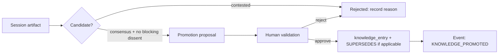

# Memory Architecture

**Version:** 1.1 · **Status:** T5-08 implemented
**Port:** `MemoryProvider` ([PORTS.md §9](PORTS.md)) · **Storage:** PostgreSQL plus Redis for
working state only ([ADR-009](adr/ADR-009-redis-ephemeral-only.md)) ·
**Requirements:** FR-405, FR-406, FR-907, NFR-011

## 1. What memory is not here

Memory is not a transcript store, not a vector dump of past conversations, and not a mechanism
by which the system "gets better on its own". The platform's memory exists so that an agent can
be *situated* — it knows its domain, its prior commitments and what has been validated — without
the platform silently laundering its own past output into future evidence.

The line that must not be crossed: **consensus history never auto-promotes to knowledge**
(FR-406, FR-907). Everything below is designed around keeping that line visible.

## 2. Tiers

| Tier | Contents | Store | Lifetime | Authority |
| --- | --- | --- | --- | --- |
| **Working** | round scratch, pending turn bundles, rate counters, retrieval cache, locks | Redis | ≤ 24 h TTL | none — may be lost without correctness impact |
| **Episodic** | the append-only event ledger, sessions, rounds, positions, critiques | PostgreSQL `reasoning_events` | indefinite | authoritative record of *what happened* |
| **Semantic** | validated knowledge entries: facts, vetted constraints, curated corpora | PostgreSQL promotion/evidence/lifecycle facts + `historical` namespace | indefinite; stale/archive remains resolvable | authoritative for *what is held to be true* |
| **Procedural** | agent definitions, prompts, reasoning strategies, consensus configs | PostgreSQL, versioned, immutable once used | versioned forever | determines behaviour; never content |

Episodic memory records what the platform did. It does not, by itself, license any future
assertion. Only semantic memory may be cited as established, and only entries that reached it
through the promotion workflow.

## 3. Scope model

`MemoryScope` names exactly one tier-specific authority: working/episodic require `session_id`,
semantic requires `namespace_id`, and procedural requires immutable `agent_def_id`.

- **MS-1** Every read and write names a scope explicitly. There is no ambient memory.
- **MS-2** Agent-private memory is scoped to immutable `agent_def_id`; every version has a distinct ID. A new agent
  version starts with a clean private memory unless a promotion record says otherwise, so
  experiments are not contaminated by accumulated state
  ([EXPERIMENTATION.md](EXPERIMENTATION.md)).
- **MS-3** Session memory is invisible to other sessions except through `historical` promotion.
- **MS-4** Cross-workspace access is impossible at the row level (RLS), not by convention
  (FR-109).

<!-- trace: FR-406 -->
## 4. Promotion workflow

The only path from episodic to semantic memory:



Rules:

- **P-1** A promotion proposal may cite consensus as *motivation*; it may not cite consensus as
  *justification*. T5-08 requires at least one active `EVIDENCE` artifact from the source session,
  non-empty caveats and named human justification ([EPISTEMIC_MODEL.md](EPISTEMIC_MODEL.md) §8).
- **P-2** Promotion requires an actor with the `knowledge:promote` permission. Self-promotion by
  an agent is impossible by construction (FR-907).
- **P-3** A promoted entry records: source artifact ids, validator, timestamp, scope, expiry
  policy and the caveats carried forward.
- **P-4** Superseding a promoted entry creates a new version and an event; the old entry stays
  queryable so that sessions which relied on it remain explainable.
- **P-5** Promotion into `global` requires a second, independent validator.

## 5. Decay and retention

| Memory | Policy | Rationale |
| --- | --- | --- |
| Working | TTL ≤ 24 h, no persistence | ephemeral by contract |
| Episodic | indefinite, partitioned monthly | replay, audit, research value |
| Semantic | indefinite; `review_by` date optional per entry | stale knowledge must be findable, not silently deleted |
| Procedural | indefinite once referenced by a session | reproducibility (NFR-003) |
| Retrieval cache | TTL ≤ 1 h, keyed by `(namespace, query_hash, index_version)` | cost, not correctness |

Decay is a *review trigger*, never an automatic forgetting mechanism. An entry whose `review_by`
has passed is flagged `STALE` and continues to work; the flag appears wherever it is cited.

## 6. What is deliberately excluded

| Excluded | Why |
| --- | --- |
| Raw LLM completions as memory | re-derivable from the manifest; mostly redundant; would become an unaccountable second truth |
| Chain-of-thought | never stored at all (NFR-011) |
| Session transcripts as retrievable text | turns a reasoning platform into a chat log |
| Implicit "lessons learned" summaries | an unattributable, unversioned claim — the worst kind of memory |
| Embeddings of agent output as knowledge | similarity is not justification |

## 7. Port contract

`MemoryProvider` ([PORTS.md §9](PORTS.md)) is the only path to memory from agent-side code:

```python
class MemoryProvider(Protocol):
    async def read(self, scope: MemoryScope, query: MemoryQuery) -> MemoryResult: ...
    async def write(self, scope: MemoryScope, entry: MemoryEntry) -> MemoryRef: ...
    async def promote(self, source: ArtifactRef, target: MemoryScope,
                      validation: ValidationRecord) -> MemoryRef: ...
    async def expire(self, scope: MemoryScope, policy: RetentionPolicy) -> int: ...
```

- `read` requires an explicit semantic workspace/namespace scope inside a caller-owned RLS transaction.
  Principal/grant authorization remains retrieval/API composition ownership; no ambient namespace read exists.
- `write` into `tier = SEMANTIC` is **only** reachable through `promote`; the adapter rejects
  direct semantic writes. Deferred PostgreSQL constraints also reject entries without one promotion
  and promotions without evidence, so bypassing the adapter does not bypass policy.
- `expire` flags and moves rows to the retention archive; it never issues `DELETE` on episodic
  or semantic rows (FR-303).
- Promotion, promotion evidence and stale/archive lifecycle are append-only forced-RLS facts. Read
  access audit remains API/composition work; T5-08 does not invent an unfrozen audit port.

## 8. Failure modes

| Failure | Detection | Behaviour |
| --- | --- | --- |
| Redis loss | connection error | rebuild working state from the ledger; sessions continue, cost only |
| Ledger gap | sequence check at replay | session marked `REPLAY_UNSAFE`; results stay valid but are labelled |
| Promotion without active validator/evidence/caveat | FKs, checks and deferred triggers | transaction fails |
| Stale semantic entry cited | `review_by` passed | rendered with a `STALE` badge and counted in EP-03 |
| Memory bleed across workspaces | RLS test in CI | build failure (FR-109) |
| Unbounded working memory growth | size gauge per session | round aborted with `BUDGET_EXCEEDED`, never silently truncated |

## 9. Related

[RAG_ARCHITECTURE.md](RAG_ARCHITECTURE.md) · [REPRODUCIBILITY.md](REPRODUCIBILITY.md) ·
[AUDITABILITY.md](AUDITABILITY.md) · [DATA_MODEL.md §11, §15](DATA_MODEL.md) ·
[AGENT_MODEL.md](AGENT_MODEL.md)

