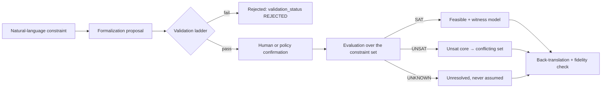

# Neuro-Symbolic Reasoning

**Version:** 1.0 · **Status:** design
**Port:** `SymbolicReasoner` ([PORTS.md §7](PORTS.md)) · **Storage:** `formalizations`,
`symbolic_evaluations` ([DATA_MODEL.md §10](DATA_MODEL.md)) · **ADR:**
[ADR-015](adr/ADR-015-z3-symbolic-reasoner.md) ·
**Requirements:** FR-705 … FR-708, NFR-003

## 1. Division of labour

The neural side is good at proposing structure: reading a policy question and producing
alternatives, constraints, objectives and arguments. The symbolic side is good at a narrow,
decisive class of questions: does this set of constraints admit any solution at all, what
exactly is inconsistent, and what follows from these premises.

The contract between them is asymmetric and deliberate:

| | Neural | Symbolic |
| --- | --- | --- |
| Proposes content | yes | no |
| Proposes formalization | yes | no |
| Checks formalization validity | no | yes |
| Declares a constraint violated | no | yes, given a validated formalization |
| Declares a claim true | no | **no** — only `SAT` under the encoded premises |
| May alter the graph | only through proposals | only through evaluations, and only on validated formalizations |

**The symbolic layer can veto feasibility. It can never author content.** That asymmetry is the
whole design; everything else is bookkeeping to keep it true.

## 2. Pipeline



## 3. Formal language

MVP uses a two-sorted fragment: linear real arithmetic for quantitative constraints, and
uninterpreted functions plus boolean structure for categorical ones. This is the Z3-supported
fragment chosen in [ADR-015](adr/ADR-015-z3-symbolic-reasoner.md).

Deliberately excluded from MVP: quantifier alternation over unbounded domains, non-linear real
arithmetic, induction, higher-order reasoning, and probabilistic logic. Each is a research item
with its own engine, not a flag.

A formalization is stored as a typed AST plus a canonical textual rendering. The rendering is
what humans review; the AST is what the solver consumes; `ast_hash` links them.

<!-- trace: FR-707 -->
## 4. Formalization contract

```python
class FormalizationProposal(TypedDict):
    statement_id: str            # the CLAIM or CONSTRAINT being formalized
    ast: FormalAST
    rendering: str               # canonical, human-readable
    symbols: list[SymbolDecl]    # name, sort, intended meaning, units
    premises: list[str]          # artifact ids assumed to hold
    limitations: list[str]       # what the encoding cannot express
    fidelity_notes: str          # where meaning was lost
```

- **F-1** A proposal is never applied silently. Authoritative `validation_status` is derived from
  immutable validation and human-decision facts. Deterministic validation failure or explicit human
  rejection yields `REJECTED`; validation success remains `CANDIDATE` until explicit human confirmation
  yields `VALIDATED` (FR-707). Legacy `ConstraintPayload.formal_status` is payload metadata only.
- **F-2** `limitations` and `fidelity_notes` are required and are rendered next to every result
  derived from the formalization. An encoding that quietly drops "unless the market is
  illiquid" is worse than no encoding.
- **F-3** Two formalizations of the same statement may coexist; evaluations name which one they
  used. Disagreement between encodings is a finding, recorded as a `MODEL` uncertainty.
- **F-4** Repair is a new proposal with a new id. A validated formalization is immutable.

## 5. Validation ladder

Each rung is checked before the next; a failure at any rung stops the pipeline with a specific
code.

| Rung | Check | Failure code |
| --- | --- | --- |
| 1 Parse | AST well-formed, sorts consistent | `FORMAL_PARSE` |
| 2 Symbol grounding | every symbol declared with meaning and units | `FORMAL_SYMBOL` |
| 3 Type/unit consistency | arithmetic operands share units | `FORMAL_UNIT` |
| 4 Local satisfiability | the single constraint is not self-contradictory | `FORMAL_VACUOUS` |
| 5 Redundancy | the constraint is not already entailed | warning `FORMAL_REDUNDANT` |
| 6 Equivalence | rendering re-parse yields `ast_hash`-equal AST | `FORMAL_ROUNDTRIP` |
| 7 Human confirmation | required for `modality = HARD` | `FORMAL_UNCONFIRMED` |

Rung 6 catches the most common real failure: a rendering that reads plausibly to a reviewer but
does not say what the AST says.

<!-- trace: FR-705, FR-706, FR-708 -->
## 6. Evaluation

`SymbolicReasoner` is an AGORA-owned port;
`Z3SymbolicReasoner` is an infrastructure adapter and no Z3 expression, model, context, or exception crosses
that boundary. Each invocation creates an isolated context and solver, applies the configured bounded timeout
(`SYMBOLIC_TIMEOUT_MS`, default 5000, accepted range 1–60000), and returns immutable metadata containing the
formalisation revision id, AST hash, solver/version, timeout, and configuration identity.

The implemented fragment is exactly the closed T11-01 AST: BOOLEAN, INTEGER, and REAL declarations;
boolean literals, canonical integer/real literals, and declared symbol references; `NOT`, `AND`, `OR`, `NEG`,
`ADD`, `SUB`, `MUL`, `DIV`, `EQ`, `NE`, `LT`, `LE`, `GT`, and `GE`. Implication is represented by the existing
closed AST as `(NOT antecedent) OR consequent`; no new operator was added. Decimal strings go directly to
Z3 `RealVal`, and integer division is explicitly lifted to exact real division, so no binary floating-point
conversion occurs. Arbitrary SMT-LIB, dynamic evaluation, undeclared/inferred symbols, unsupported sorts or
operators, invalid arity, and sort mismatches fail closed as invalid/unsupported input rather than `UNSAT`.

`SAT`, `UNSAT`, and `UNKNOWN` are independent symbolic outcomes. `UNKNOWN` preserves a safe
`reason_unknown`; timeout is therefore unresolved, never satisfaction or violation. `VALIDATED != SAT` and
`SAT != VALIDATED`: structural validation, human confirmation, formalisation lifecycle, and enforceability
remain unchanged. In particular, `UNSAT` does not revoke human confirmation or automatically reject a
formalisation. T11-03 persists each exact-revision result, exact typed SAT witness, or deterministic-path UNSAT
core as append-only tenant-scoped evidence. It creates no lifecycle mutation, graph edge, policy verdict, API,
or outbox fact.

SAT witnesses include every declared symbol in lexical name order. The adapter requests model completion,
so an unconstrained declaration receives Z3's deterministic default for its sort rather than being omitted.
BOOLEAN values remain booleans, INTEGER and rational REAL values use reduced decimal-string numerator and
positive denominator pairs, and irrational algebraic REAL values use an integer polynomial plus root index.
No binary floating-point or decimal approximation is persisted.

Evaluations run over a **constraint set** attached to an alternative, not over a single
constraint in isolation.

| Result | Meaning | What the platform does |
| --- | --- | --- |
| `SAT` | the set admits at least one solution | returns exact BOOLEAN, INTEGER, RATIONAL, or algebraic witness values |
| `UNSAT` | no solution exists | returns a contradiction-sufficient core of recursively flattened conjunction members |
| `UNKNOWN` | the solver could not decide within budget | returns `UNKNOWN` with safe reason and timeout metadata; never treated as `SAT` (FR-708) |

### 6.1 Application policy for `UNKNOWN`

T11-04 keeps the solver fact and the application action separate. The deterministic
`SymbolicUnknownPolicy` maps an exact persisted evaluation as follows:

| Solver fact | Application action | Meaning |
| --- | --- | --- |
| `SAT` | `PROCEED` | positive symbolic assurance exists under the encoded premises |
| `UNSAT` | `BLOCK` | a contradiction was established; the unsat core remains the evidence |
| `UNKNOWN` | `DEFER` | symbolic assurance is unavailable; any action that requires it must wait |

`DEFER` is not rejection and does not rewrite the evaluation. It means only that this evaluation cannot
serve as affirmative symbolic evidence. Timeout, incomplete, and other unknown reasons are classified as
`TIMEOUT`, `INCOMPLETE`, or `OTHER` by a stable AGORA-owned mapping; bounded safe reason codes may be shown
for explanation, but lifecycle decisions never depend on parsing arbitrary Z3 text. There is no automatic
retry or human-override workflow in T11-04.

The consensus feasibility gate is the current downstream consumer. It may rank an `UNKNOWN` alternative
for decision support, but the alternative remains explicitly unresolved, its score retains feasibility
`UNKNOWN`, and selection forces `CONDITIONAL_CONSENSUS`. That is not positive symbolic assurance and does
not authorize a certainty-requiring action. `UNKNOWN` is never removed as if it were `UNSAT`.

Therefore: `UNKNOWN` is not `SAT`, is not `UNSAT`, is not automatic rejection, and cannot be used as
affirmative symbolic evidence. `VALIDATED != SAT`, `SAT != VALIDATED`, and `UNSAT != REJECTED` remain true.
| typed error | malformed, unsupported, or solver failure | fails closed without changing formalisation lifecycle state |

The unsat core is the payload. It is contradiction-sufficient, not claimed to be minimum-cardinality.
"These four constraints cannot all hold" is actionable; "the
problem is infeasible" is not. The core is rendered as the natural-language statements with their
authors and provenance, and it becomes the explanation for an `INFEASIBLE` consensus outcome
([CONSENSUS_MODEL.md §4](CONSENSUS_MODEL.md)).

The witness model is equally important in the other direction: it shows *what the constraints
allow*, which frequently reveals an under-constrained problem — a budget with no ceiling, a
quantity with no bounds. Under-constraint is reported as `FORMAL_UNDERCONSTRAINED`.

## 7. Back-translation and fidelity

Every evaluation is rendered back into natural language and paired with the original statement:

```text
original : "the programme must not exceed the fiscal ceiling next year"
formal   : cost_2027 <= ceiling_2027
result   : UNSAT, core = {cost_2027 <= ceiling_2027,
                          cost_2027 >= 0.9 * spend_run_rate * 12,
                          spend_run_rate * 12 > ceiling_2027}
reading  : "no assignment satisfies all three; the run-rate floor and the ceiling conflict"
```

- **BT-1** The reading names the constraints involved and their artifact ids.
- **BT-2** The reading states the encoding's limitations verbatim from `limitations`.
- **BT-3** A back-translation that a reviewer rates as unfaithful demotes the formalization to
  `PROPOSED` and re-opens the question. Fidelity review is part of the loop, not a postmortem.

## 8. Contradiction detection and propagation

Two directions are checked continuously at round boundaries:

1. **Constraint vs constraint** — the conjunction of hard constraints is tested for `SAT`
   (FR-705).
2. **Claim vs claim** — pairs asserted with opposite polarity over the same normalized
   proposition, plus pairs whose conjunction is `UNSAT` (FR-706).

A detected contradiction creates a `CONTRADICTS` edge and a `MISSING_DISTINCTION` or
`LOGICAL_FALLACY` critique attributed to the symbolic engine, not to an agent. Impact then
propagates: every claim that `YIELDS` from a contradicted premise is marked `CONTESTED`
([REASONING_GRAPH.md §6](REASONING_GRAPH.md)).

## 9. Assumption tracking

Assumptions are encoded as **soft constraints with a retraction handle**. Dropping an assumption
means removing its soft constraint and re-running; the delta is the assumption's contribution.
This is what makes `impact_of(assumption)` cheap and what feeds `RB-02 assumption sensitivity`
([METRICS.md §4.5](METRICS.md)).

## 10. Limits and known failure modes

| Failure | Why it happens | Guard |
| --- | --- | --- |
| Over-formalization | a vague normative statement is forced into arithmetic | rung 4 plus mandatory `limitations`; a statement may be refused |
| Wrong but plausible encoding | the AST says something the sentence did not | rung 6 round-trip, BT-3 fidelity review |
| Silent idealization | "should" becomes `<=` | modality preserved as a field; hard/soft distinction explicit (FR-703) |
| `UNKNOWN` read as fine | timeout treated as success | C-8, FR-708; `RR-07` threshold |
| Unit smuggling | a percentage compared to a count | rung 3 |
| Vacuous truth | an empty feasible set praised as consistent | `FORMAL_VACUOUS`, `INFEASIBLE` outcome class |
| Authority creep | a `SAT` result quoted as proof the plan is good | BT-2, E-4, UI labels state "consistent under these premises" |

**NS-1** A symbolic result may never be the sole basis for a `FACT`.
**NS-2** `SAT` means *consistent with the encoded premises*, and every rendering says so.
**NS-3** The engine is deterministic given `(ast_hash, solver_version, timeout)`.
**NS-4** Where two engines disagree, both results are shown; neither is averaged away.

## 11. Related

[REASONING_GRAPH.md](REASONING_GRAPH.md) · [CONSENSUS_MODEL.md](CONSENSUS_MODEL.md) ·
[EPISTEMIC_MODEL.md](EPISTEMIC_MODEL.md) · [SIMULATION_ARCHITECTURE.md](SIMULATION_ARCHITECTURE.md) ·
[DATA_MODEL.md §10](DATA_MODEL.md) · [PORTS.md §7](PORTS.md)

