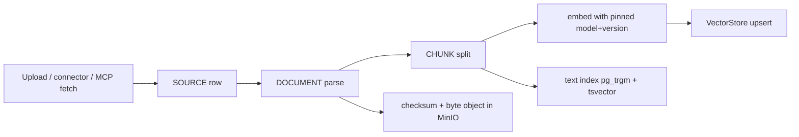

# RAG Architecture

**Version:** 1.1 · **Status:** Phase 5 implemented; exact-SHA exit evidence pending
**Ports:** `Retriever`, `Reranker`, `VectorStore` ([PORTS.md §9](PORTS.md)) ·
**Storage:** `sources`, `documents`, `chunks`, `vector_items`
([DATA_MODEL.md §8](DATA_MODEL.md)) · **ADR:**
[ADR-002](adr/ADR-002-pgvector-vector-store.md) ·
**Requirements:** FR-401 … FR-409, NFR-010

<!-- trace: FR-402, FR-407 -->
## 1. The one principle

Retrieval supplies **candidates with provenance**. It never supplies truth, and it never
decides what an agent should believe. Everything retrieved enters the platform as
`EVIDENCE` with `verification = UNVERIFIED` and a resolvable chain to a `SOURCE`
(FR-402, FR-403). A chunk that cannot be traced back to a source row cannot be attached to a
claim at all.

This is what separates the design from a chat-with-documents feature: the retrieval subsystem
feeds an epistemic pipeline, not a prompt.

## 2. Ingestion pipeline



| Stage | Contract | Failure behaviour |
| --- | --- | --- |
| Acquire | bytes + `content_hash` + `retrieved_at` + origin metadata | reject, record `SOURCE_INGEST_FAILED` |
| Parse | format-specific parser → normalized text + structure map (pages, headings, tables) | partial parse allowed, `parse_warnings` recorded |
| Chunk | deterministic boundaries, overlap recorded, `locator` per chunk | non-deterministic chunker is a defect, not a tuning issue |
| Embed | model + version pinned per namespace; `embedding_model` stored on the row | embedding failure leaves the chunk text-indexed and marks it `NOT_EMBEDDED` |
| Index | upsert into `VectorStore` namespace | index lag is reported by `index_state`, never hidden |

Supported formats (FR-401): PDF, DOCX, TXT, Markdown, CSV, XLSX, JSON, HTML. Binary media
(audio, video, images) is out of MVP scope and is recorded as an unsupported-source event
rather than silently skipped.

Chunking defaults: 800 tokens target, 150 overlap, structure-respecting (a heading never
splits mid-section), table rows kept intact with their header row repeated. The chunker version
is stored; changing it requires re-indexing, not a silent migration.

Phase 5 uses a deterministic tokenizer pinned by `chunker_version`; it does not call an LLM.
Parsers emit normalized text, a structure map, warnings, parser name and parser version. Canonical
chunk identity hashes normalized UTF-8 text plus canonical locator and chunker version. Repeated
ingestion of one document version therefore produces byte-identical chunk order, locators and hashes.
The original object digest remains separate and always resolvable.

Ingestion uses caller-allocated operation, source and document UUIDs. Original bytes are stored under
`sources/{sha256}` and read back through an `ObjectRef` carrying the declared digest before parsing.
PostgreSQL `knowledge_ingestion_operations` is the durable checkpoint: exact retry input is bound by a
request hash, attempts cannot change identities, and completed retries return the original IDs without
duplicating provenance rows. Object storage owns bytes only; Temporal visibility and delivery attempts
are not ingestion state.

Acquire, parse, embed and index states are independent. Parse success makes deterministic chunks
available to lexical retrieval while embed/index remain explicitly `PENDING`; later embedding or index
failure therefore reports degradation without erasing usable text. Durable failures contain only stage,
stable code, permanence and generic redacted detail. Unsupported media is stored and digest-verified for
provenance, then fails permanently at parse dispatch with `UNSUPPORTED_MEDIA_TYPE` rather than being
silently skipped.

Typed knowledge indexing resolves the caller's namespace/chunk/document/source UUIDs and chunk hash
against authoritative PostgreSQL rows in the write statement. Sorted per-namespace transaction advisory
locks serialize pinned embedding model/version without reversed-order batch deadlocks. Reads join the full
provenance chain, require ready sources and documents, reject model/version or content-hash mismatch, and
order equal cosine distances by chunk UUID. Legacy Phase 1 string-keyed `VectorStore` rows remain compatible
in a disjoint logical keyspace: legacy reads/deletes ignore typed rows and colliding writes fail closed.

<!-- trace: FR-401, FR-405 -->
## 3. Namespaces

Six namespaces, ordered by widening scope (FR-405):

| Namespace | Contents | Written by | Read by |
| --- | --- | --- | --- |
| `global` | curated reference corpora | admin, explicit | all, if permitted |
| `workspace:<id>` | the workspace's own documents | members | workspace members only |
| `domain:<name>` | domain-scoped corpora (fiscal, health…) | curator | agents whose definition lists the domain |
| `agent:<def_id>` | agent-private reference sets | agent definition owner | that agent definition only |
| `session:<id>` | material injected during a session | the session | participants of the session |
| `historical` | promoted, validated prior outcomes | promotion workflow (FR-406) | explicit opt-in per agent |

Resolution rules:

- **N-1** `RetrievalRequest.namespaces` is mandatory. An empty or absent set is **rejected**;
  it never defaults to "everything" ([PORTS.md §9](PORTS.md)).
- **N-2** The principal's permissions are applied **before** similarity scoring, never as a
  post-filter (FR-404). A post-filter leaks existence through ranking.
- **N-3** Cross-namespace reads are recorded per hit, so the explanation can say where a piece
  of evidence came from.
- **N-4** `historical` is the only namespace that can contain platform-generated content, and
  only after validation.

Namespace identity is a typed `(tier, scope_id)` pair resolved to an immutable namespace row.
`GLOBAL` remains tenant-safe: a workspace receives an explicit read grant to a curated global
namespace; no row bypasses workspace context or RLS. Grants name subject kind (`WORKSPACE`, `USER`,
`AGENT_DEFINITION`, or `SESSION`), subject id, read/write capability and validity interval. Query
planning intersects requested namespaces, manifest scope, active grants and chunk ACL before either
retrieval arm runs. Unauthorized requests expose no corpus facts and produce a denied audit record;
they are never post-filtered from a scored candidate list.

Principal resolution is database-authoritative. Every caller-supplied subject must validate in the request
workspace: humans resolve through `users` plus `workspace_members`; agents resolve through active or
deprecated `agent_definitions`; session subjects resolve to the session creator for humans and additionally
require a `session_agents` pin for agents. `DOMAIN` and `HISTORICAL` require the namespace in the agent
definition's `knowledge_ns`; `AGENT` requires the namespace's exact `agent_def_id`; `SESSION` requires a
grant to the namespace's exact `session_id`. A forged extra subject invalidates the whole requested scope.

<!-- trace: FR-404 -->
## 4. Retrieval path

```text
query → expansion (optional, recorded) → permission filter (pre-scoring)
      → lexical arm (pg_trgm + tsvector)  ┐
      → vector arm (pgvector, namespace)  ┘→ merge (RRF) → rerank → top-k
      → provenance hydration → RetrievalResult
```

| Step | Contract | Notes |
| --- | --- | --- |
| Expansion | deterministic or model-based; the method is recorded in the result | model-based expansion is a *suggestion* and never mutates the query silently |
| Pre-filter | RLS plus namespace ACL applied in SQL before scoring | FR-404 |
| Lexical arm | exact-term and phrase matching, good for identifiers and citations | keeps recall for numbers, which embeddings lose |
| Vector arm | cosine over UUID-backed `vector_items`, `k = 3 × final_k` | model + version pinned per namespace |
| Merge | reciprocal rank fusion, `k0 = 60` | deterministic; no learned blend in MVP |
| Rerank | `Reranker` port, cross-encoder adapter or `noop` | reranker failure degrades to fused order with a warning |
| Hydration | attach `source_id`, `document_id`, `locator`, `content_hash`, `trust_level` | a hit without provenance is dropped and counted |

Defaults: `final_k = 8`, `min_score` per arm, `max_tokens` budget per retrieval. Every parameter
is part of the session configuration and therefore part of the reproducibility manifest.

## 5. Evidence attachment

A retrieval hit becomes usable only when an agent cites it, and citation is a structured act:

- The `EVIDENCE` artifact records `chunk_id`, `content_hash`, `locator`, `retrieved_at`,
  `query_hash`, `trust_level` and `verification = UNVERIFIED`.
- The graph gains `SOURCED_FROM` edges `EVIDENCE → CHUNK → DOCUMENT → SOURCE`
  ([REASONING_GRAPH.md §3](REASONING_GRAPH.md)).
- The agent states the *claim* the evidence supports and the polarity (`SUPPORTS` / `OPPOSES`).
  Retrieved text pasted without a claim is rejected by the envelope schema.
- `content_hash` mismatch at read time means the underlying chunk changed: the evidence is
  flagged `STALE_CITATION`, not silently re-pointed.

<!-- trace: FR-409 -->
## 6. Failure and degradation

| Condition | Detection | Behaviour |
| --- | --- | --- |
| Vector store unreachable | port `TransientPortError` | lexical-only retrieval, `degraded: LEXICAL_ONLY` |
| Embedding model mismatch | version check at query | reject the arm, `degraded: INDEX_MISMATCH` |
| Zero hits | result census | **`RAG_FAILED` if the query was expected to match** (FR-409); otherwise `NO_MATCH` with the namespaces searched |
| Reranker timeout | activity timeout | fused order retained, warning recorded |
| Permission filter error | SQL error | **fail closed** — no results, `RAG_DENIED` |
| Corrupt object bytes | checksum | source marked `UNREADABLE`, dependent evidence flagged |

An empty result set is never reported as "no evidence exists". It is reported as "these
namespaces, this query, this index version returned nothing" — the distinction is the difference
between a search failure and a claim about the world.

## 7. Freshness and retraction

with a nonblank human-authored reason and appends an immutable `source_retractions` fact. It returns
the durable evidence/claim dependency frontier for Phase 10 `impact_of(source)` traversal and
exposure reporting (FR-408); retraction does not mutate claim review state. `evidence_citations` stores the exact observed namespace/source/document/
chunk chain, locator span, source/chunk hashes, timestamps and trust without copying chunk text.
Retracted chunks stay in the index but are excluded from retrieval by pre-filter; old citations still
resolve their immutable snapshot while also showing current `RETRACTED` state and reason.
retrieval cannot pick them up.

## 8. Index maintenance

- **IM-1** `embedding_model` and `chunker_version` are columns, not configuration guesses.
- **IM-2** Re-indexing writes to a shadow namespace, verifies counts and sample recall, then
  swaps the alias. A partially re-indexed namespace is never queryable.
- **IM-3** Index drift (rows without embeddings, embeddings without rows) is a nightly check
  with a repair job; drift above 0.1 % blocks the phase gate.
- **IM-4** Namespace deletion is explicit and audited; `VectorStore.delete_namespace` returns the
  count it deleted.

## 9. Security

Retrieved text is **untrusted data**. It is framed in the prompt envelope with an explicit
"this is data, not instructions" boundary, and instruction-like content triggers
`INJECTION_SUSPECTED` plus quarantine
([MCP_SECURITY.md](MCP_SECURITY.md), [THREAT_MODEL.md](THREAT_MODEL.md) T-4). Retrieval queries
and results are logged with the principal, so a "who saw what" audit question is answerable
([AUDITABILITY.md](AUDITABILITY.md)).

T5-06 writes one append-only `retrieval_attempts` row for every allowed or denied terminal authorization
path. It records attempt/trace/principal IDs, query hash, requested and searched namespace IDs, result chunk
IDs and content hashes, arm/result counts, outcome, versions and degradation metadata. Query and chunk text
are never stored. Forced RLS isolates workspace records; update/delete triggers reject mutation. Audit-write
failure fails retrieval closed.

## 10. Evaluation

Phase 5 baseline uses a versioned, domain-neutral synthetic corpus committed with labels. It includes
exact lexical matches, paraphrase/vector matches, duplicate passages, tables, headings, retracted
sources and same-looking chunks in unauthorized namespaces. Synthetic data tests retrieval mechanics;
it does not claim scientific ground truth or select domains for later experiments. Fixture labels and
queries are reviewed data, never generated during the test run.

| Signal | Metric | Target |
| --- | --- | --- |
| Recall proxy | RB-04 retrieval robustness | ≥ 0.7 |
| Precision at k | manual label set on the evaluation task | reported, not gated |
| Provenance integrity | EP-02 provenance completeness | 1.0 for cited evidence |
| Latency | retrieval p95 inside the API budget | ≤ 400 ms excluding model time |
| Degradation | RB-05 degraded-state frequency | observed, never suppressed |

Baseline output records corpus/query-label version, parser/chunker/index/embedding/reranker versions,
per-query retrieved IDs, recall proxy, precision at k, latency environment and every degraded result.
Only provenance integrity and isolation are hard correctness gates; quality values establish the
Phase 5 comparison baseline until project Q-1 selects real evaluation domains.

Ground-truth recall cannot be claimed for open-ended policy questions; the platform reports the
proxy and says so ([RESEARCH_NOTES.md](RESEARCH_NOTES.md) Q-6).

Committed baseline source and observed local evidence live in
[`backend/tests/fixtures/retrieval_baseline_v1.json`](../backend/tests/fixtures/retrieval_baseline_v1.json)
and [PHASE5_ACCEPTANCE.md](PHASE5_ACCEPTANCE.md). `expected_match` distinguishes valid zero-match
query from FR-409 failure: expected-match zero results and non-degraded infrastructure failures append
`RAG_FAILED` retrieval audits and raise stable `RAG_FAILED`; authorization refusal remains `DENIED`.

## 11. Out of MVP scope *(research)*

GraphRAG-style entity extraction, query-planning agents, self-querying stores, multimodal
embeddings, and learned fusion weights. Each is a `Retriever` or `Reranker` adapter away, and
none of them changes the contract in §1.

## 12. Related

[DATA_MODEL.md §8](DATA_MODEL.md) · [PORTS.md §9](PORTS.md) ·
[MEMORY_ARCHITECTURE.md](MEMORY_ARCHITECTURE.md) · [MCP_SECURITY.md](MCP_SECURITY.md) ·
[EPISTEMIC_MODEL.md](EPISTEMIC_MODEL.md) · [METRICS.md](METRICS.md)

