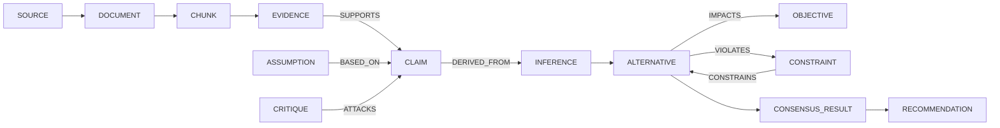

# Reasoning Graph

**Version:** 1.0 · **Status:** design
**Storage:** PostgreSQL `graph_nodes` / `graph_edges`
([ADR-007](adr/ADR-007-postgres-reasoning-graph.md),
[DATA_MODEL.md §9](DATA_MODEL.md)) · **Port:** `ReasoningGraphStore`
([PORTS.md](PORTS.md))

## 1. What the graph is, and is not

The graph is a **materialized projection over `reasoning_artifacts`**. It exists to make provenance
traversal cheap. It is not a second system of truth: every node resolves to exactly one
artifact row, and the graph can be dropped and rebuilt from those rows in a single
transaction. Any behaviour that depends on information present *only* in the graph is a
defect.

## 2. Node types

Phase 3 node types are exactly `CLAIM`, `FACT`, `ASSUMPTION`, `INFERENCE`, `PROPOSITION`,
`EVIDENCE`, `UNCERTAINTY`, `RISK`, `IMPACT`, `OBJECTIVE`, `CONSTRAINT`, `ALTERNATIVE`, `POSITION`,
`CRITIQUE`. Later phases add `SOURCE`, `DOCUMENT`, `CHUNK`, `SIMULATION_RUN`,
`SIMULATION_RESULT`, `SYMBOLIC_EVALUATION`, `AGENT`, `ROUND`, `SESSION`, `CONSENSUS_RESULT`,
`RECOMMENDATION`, `METRIC_VALUE` and `EVENT` by expanding the database CHECK.

Phase 3 node payload is an artifact `ref_id` plus `kind`, display `label` and cached `attrs`.
Cached attributes are never authoritative.

## 3. Edge types

| Edge | From → To | Meaning | Qualifier |
| --- | --- | --- | --- |
| `SUPPORTS` | EVIDENCE/CLAIM → CLAIM | bears positively | strength, weight |
| `OPPOSES` | EVIDENCE/CLAIM → CLAIM | bears negatively | strength, weight |
| `CONTRADICTS` | CLAIM ↔ CLAIM | mutually inconsistent | which assumption breaks |
| `DERIVED_FROM` | CLAIM → CLAIM \| ASSUMPTION \| FACT | conclusion of an inference | rule kind, validity |
| `BASED_ON_ASSUMPTION` | CLAIM/ALTERNATIVE → ASSUMPTION | depends on it to stand | materiality |
| `SOURCED_FROM` | EVIDENCE → CHUNK → DOCUMENT → SOURCE | provenance chain | locator |
| `FORMALIZES` | PROPOSITION → CLAIM | normalized form of | canonicalizer version |
| `QUANTIFIES` | UNCERTAINTY → any | attaches to | type |
| `IMPACTS` | ALTERNATIVE → OBJECTIVE | modelled effect | magnitude, unit, timeframe |
| `CONSTRAINS` | CONSTRAINT → ALTERNATIVE \| OBJECTIVE | limits | modality, verdict |
| `VIOLATES` | ALTERNATIVE → CONSTRAINT | hard failure | symbolic evaluation id |
| `SATISFIES` | ALTERNATIVE → CONSTRAINT | hard pass | witness |
| `INFEASIBLE_UNKNOWN` | ALTERNATIVE → CONSTRAINT | solver returned `UNKNOWN` | solver, wall time |
| `ATTACKS` | CRITIQUE → any artifact | targets | type, severity |
| `RESPONDS_TO` | POSITION/CLAIM → CRITIQUE | answers an attack | response kind |
| `SUPERSEDES` | versioned → same logical, prior version | revision | reason |
| `WITHDRAWS` | EVENT → any artifact | withdrawal record | actor, reason |
| `ADVOCATES` | AGENT/POSITION → ALTERNATIVE | stance | confidence |
| `CONSIDERS` | SESSION → ALTERNATIVE | candidate set | — |
| `SCORED_BY` | ALTERNATIVE → METRIC_VALUE | measurement | profile |
| `YIELDS` | CONSENSUS_RESULT → RECOMMENDATION | outcome | rank |
| `PRODUCED_BY` | any artifact → AGENT \| EVENT | authorship | round |
| `PRECEDES` | ROUND → ROUND | ordering | — |
| `SIMULATES` | SIMULATION_RUN → ASSUMPTION \| MODEL | exercises | spec hash |
| `VALIDATES` | SYMBOLIC_EVALUATION → CONSTRAINT | formal check | verdict |

`INFEASIBLE_UNKNOWN` exists because a solver that gives up must not be rendered as either a
pass or a failure.

Only edges whose endpoints are Phase 3 node types can be persisted in Phase 3. `SOURCED_FROM`,
`WITHDRAWS`, `ADVOCATES` from `AGENT`, `CONSIDERS`, `SCORED_BY`, `YIELDS`, `PRODUCED_BY`,
`PRECEDES`, `SIMULATES` and `VALIDATES` activate with their owning later-phase node migrations.

<!-- trace: FR-408 -->
## 4. Invariants

- **G-1** Every node has exactly one `ref_id` resolving to `reasoning_artifacts`; it is unique per session.
- **G-2** Edges never cross workspaces. Enforced by trigger, not by convention.
- **G-3** `SUPERSEDES` forms a chain, never a DAG: one predecessor per version.
- **G-4** `SUPPORTS`/`OPPOSES` between two claims require a `DERIVED_FROM` or `EVIDENCE`
  intermediary somewhere upstream — bare assertion loops are rejected.
- **G-5** The graph is acyclic except for explicitly permitted cycles: `CONTRADICTS`
  (symmetric), `SUPERSEDES` chains, and `ATTACKS`/`RESPONDS_TO` pairs.
- **G-6** A cycle detected outside the permitted set fails the write, not the read.
- **G-7** Deleting an artifact is impossible, so no edge is ever orphaned by a delete.

## 5. Traversal operations

| Operation | Direction | Depth | Used by |
| --- | --- | --- | --- |
| `provenance_of(artifact)` | backward to reasoning roots; citations resolve source/document/chunk | bounded to 12, cycle-safe | explanation, audit |
| `impact_of(source)` | forward to `RECOMMENDATION` | unbounded | retraction (FR-408) |
| `support_chain(claim)` | backward through `SUPPORTS`/`DERIVED_FROM` | `max_depth` | UI drill-down |
| `attack_surface(claim)` | `ATTACKS` in, `RESPONDS_TO` out | 2 | critique view |
| `assumption_closure(alt)` | `BASED_ON_ASSUMPTION` transitive | unbounded | sensitivity |
| `constraint_closure(alt)` | `CONSTRAINS`/`VIOLATES` | 1 | feasibility gate |
| `objection_lineage(rec)` | backward through `CONSENSUS_RESULT` | unbounded | minority report |
| `subgraph(ids, radius)` | both | `radius ≤ 5` | graph view |

All traversals are recursive CTEs with cycle detection and a default `max_depth` of 12.
Results use opaque cursor pagination with a default page size of 100 and a hard cap of 200.
Ordering is deterministic (node UUIDs, then edge UUIDs), and cursors are bound to direction,
tenant, session, roots, depth and edge filters. `truncated` reports that the depth bound hid
reachable nodes; `next_cursor` independently reports that another page remains.

T10-02 does not project `SOURCE`, `DOCUMENT`, or `CHUNK` as graph nodes. Artifact provenance uses
`trace_backward` over the existing reasoning-artifact graph and enriches each reached `EVIDENCE` node
from canonical `EvidenceCitation` records. Those immutable records identify the source, document, and
chunk snapshots; citation resolution separately exposes the source's current status, including retraction.
Graph ancestry is context, not a truth judgment, and edge types such as `ATTACKS`, `CONTRADICTS`, and
`OPPOSES` remain distinct from positive support.

## 6. Impact analysis

When a source is retracted, workspace-wide `impact_of(source)` starts from every canonical citation
root and exhausts every cursor from the bounded, cycle-safe T10-01 `trace_forward` traversal. A depth
frontier continues in another bounded segment, so one page, source root, session, or 12-hop segment
cannot silently truncate the closure. The result reports `COMPLETE` or `INCOMPLETE` explicitly and
returns dependent claims, affected alternatives, consensus results, and recommendations. The exact
artifact revision IDs and versions are persisted in an immutable `impact_report`, and
`SOURCE_RETRACTED` is inserted into the workspace outbox in the same transaction as source retraction.
Impact is dependency exposure only: no downstream artifact is deleted, revised, invalidated, or
automatically marked contested.

## 7. Why not a graph database

Considered and rejected in [ADR-007](adr/ADR-007-postgres-reasoning-graph.md). A separate
graph engine adds a second system of truth, a second consistency protocol and a second backup
story, for traversal depths (≤ 12) that recursive CTEs handle well at the scale this project
targets. Revisit when a *measured* query exceeds the NFR-007 latency budget with evidence that
the cause is traversal rather than indexing.

## 8. Export

`GET /api/v1/graph/export` emits JSON-LD with a stable context document
([NFR-013](REQUIREMENTS.md)). Node and edge types are the enum values above; the context maps
them to `crp:` IRIs. Export MUST be reproducible: same session, same bytes, same ordering
(ordered by `seq`, then `id`).

## 9. Metrics over the graph

| Metric | Definition | Caveat |
| --- | --- | --- |
| evidence coverage | claims with ≥ 1 `SUPPORTS` / total claims | rises trivially if agents attach weak evidence |
| provenance completeness | artifacts with a full chain to `SOURCE` / total | a chain to a low-trust source is still a chain |
| contradiction density | `CONTRADICTS` edges / claim pairs | low density can mean groupthink, not agreement |
| attack coverage | claims with ≥ 1 `ATTACKS` / total | the Critic's own recall metric |
| assumption depth | mean `assumption_closure` size | deep closures mean fragile conclusions |

Definitions and versions live in [METRICS.md](METRICS.md).

