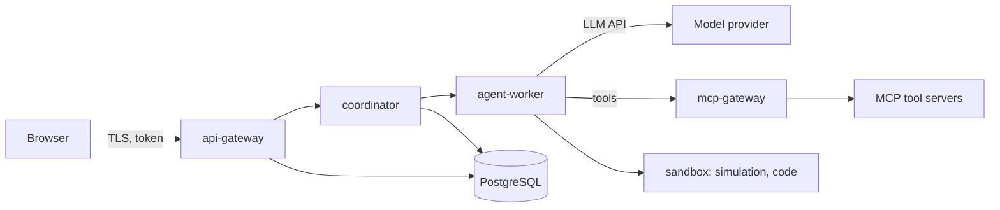

# Security

**Version:** 1.0 · **Status:** design
**Requirements:** FR-101 … FR-110, FR-1001 … FR-1007, NFR-010 · **Companion:**
[THREAT_MODEL.md](THREAT_MODEL.md), [MCP_SECURITY.md](MCP_SECURITY.md) · **ADR:**
[ADR-017](adr/ADR-017-secret-provider-docker-secrets.md),
[ADR-018](adr/ADR-018-sandbox-execution-boundary.md)

## 1. Trust boundaries

Four boundaries, each with its own assumption:

| Boundary | Assumption | Enforcement |
| --- | --- | --- |
| Browser → gateway | untrusted, token-bearing | authN, scopes, rate limits, CSP |
| Service → service | authenticated but not authoritative | mTLS, workload identities, coordinator-only writes |
| Agent → provider | data leaves the perimeter | data classification, redaction, no secrets in prompts |
| Anything → sandbox | **hostile payload inside** | no network, read-only inputs, caps, digest-only egress |

The MCP boundary is the one most likely to be gotten wrong, so it has its own document.

## 2. Identity and access

- **AuthN:** OIDC against an external IdP; the gateway accepts only `Authorization: Bearer <token>`
  and delegates verification to the `AccessTokenVerifier` port. A verified principal contains the
  external subject plus trusted `user_id`, `workspace_id`, and current membership role. The gateway
  never signs tokens and stores no local password. Human access tokens are short-lived (≤ 15 min), and
  service-to-service authentication uses workload identities rather than shared keys. Until an IdP
  adapter is configured, the production `UnconfiguredAccessTokenVerifier` rejects every token.
- **AuthZ:** three layers, all required —
  1. **RBAC** route policies use only `ADMIN`, `RESEARCHER`, `OPERATOR`, and `VIEWER`, checked at the gateway;
  2. **ABAC** rules in the coordinator for state transitions (who may move an epistemic status,
     who may promote knowledge — FR-907);
  3. **Row-level security** in PostgreSQL keyed on `workspace_id`, so a bug above the database
     still cannot cross tenants (FR-109).
- **Deny by default.** Only `/health` and `/ready` are public. Every other registered route requires
  a verified bearer principal and explicit role metadata: missing/invalid credentials return `401`,
  missing policy metadata or a disallowed role returns `403`. FastAPI's generated OpenAPI, Swagger UI,
  and ReDoc routes are disabled. An unknown path remains the normal non-enumerating `404`.
- **Agent principals.** An LLM agent is a principal with its own identity and a narrow scope set.
  It cannot obtain `artifacts:validate`, `knowledge:promote` or `audit:read` at all — these are
  not "ask a human" guardrails, they are absent grants (V-2, E-2).

## 3. Tenancy

`workspace_id` is on every row and enforced by RLS policies using
`current_setting('app.workspace_id')`, set per connection from the verified token. Cross-tenant
reads return `404`, indistinguishable from absence
([API_CONTRACTS.md §6](API_CONTRACTS.md)). Vector namespaces and object-storage prefixes carry the
same key, so isolation is not a database-only property.

<!-- trace: FR-1005 -->
## 4. Secrets

Per [ADR-017](adr/ADR-017-secret-provider-docker-secrets.md):

- Secrets live in the Swarm secret store, mounted read-only at `/run/secrets`.
- No secret is ever in an image, a compose environment value, a log line, a trace attribute or a
  prompt. A CI grep plus a runtime redaction filter enforce this (FR-1005).
- Rotation is a secret update plus a service restart; no rebuild. Rotation events are audited.
- Provider keys are scoped per workspace where the provider supports it, so a leak has a blast
  radius and a bill.

## 5. Data protection

| Concern | Control |
| --- | --- |
| In transit | TLS 1.2+ everywhere, HSTS, internal mTLS between services |
| At rest | encrypted volumes for Postgres, MinIO and the WAL archive |
| Field-level | PII columns encrypted with per-workspace keys; the key is not in the same database |
| Backups | encrypted, access-controlled, restore tested quarterly |
| Logs | structured, redaction filter at the handler, no payload bodies at INFO |
| Retention | [DATA_MODEL.md §15](DATA_MODEL.md); legal hold overrides |
| Deletion | anonymises actor references while preserving ledger structure; pseudonymisation is the documented resolution of the FR-303 / erasure tension |

<!-- trace: NFR-010 -->
## 6. Input handling

Every external input is untrusted: HTTP bodies, uploaded documents, retrieved chunks, MCP tool
results, webhook payloads, and model output.

- Strict schema validation at the boundary; unknown fields rejected, not ignored
  ([API_CONTRACTS.md §4](API_CONTRACTS.md)).
- Uploads: size caps, MIME sniffing against the declared type, archive-bomb guards, parsing in a
  restricted context.
- Retrieved and tool-returned text is framed as data and can never authorise a tool call
  ([MCP_SECURITY.md](MCP_SECURITY.md)).
- Model output is parsed against the artifact envelope; a non-conforming completion is a provider
  error, never a partial write.
- SQL: parameterised only; the graph traversal layer builds queries from a fixed grammar, never by
  string concatenation.

## 7. Supply chain

| Control | Detail |
| --- | --- |
| Pinned bases | `python:3.12-slim-bookworm` and `node:22-alpine` by digest |
| Lockfiles | `uv.lock` and `package-lock.json` committed; no floating versions in CI |
| SBOM | generated per image, retained with the image |
| Scanning | Trivy on images and dependencies; critical findings block merge |
| Secrets scanning | gitleaks on every push and in pre-commit |
| Build provenance | images built in CI only, signed, verified at Swarm deploy |
| Solvers and engines | Z3 and simulation engines pinned by version; a bump is a code change with a replay test (NFR-003) |

## 8. Sandbox

Defined in [ADR-018](adr/ADR-018-sandbox-execution-boundary.md) and
[SIMULATION_ARCHITECTURE.md §5](SIMULATION_ARCHITECTURE.md): no network egress, read-only input
mounts, CPU/memory/pid/wall-time caps, byte-limited stdout, digest-only results returned to the
coordinator. The sandbox cannot reach the database, the secret store or the event bus; it
communicates only through the provider interface.

## 9. Verification

| Check | Where |
| --- | --- |
| RLS cross-tenant suite | CI, zero failures required (FR-109) |
| Scope matrix | CI, every endpoint × scope pair |
| Injection red-team | CI fixture suite (FR-1003) |
| Secret leakage grep | pre-commit and CI |
| Dependency and image scan | CI, blocking on critical |
| AuthZ review | required for any PR touching `api-gateway/authz/` or a migration that adds tables |
| Penetration test | before public beta, not before the MVP gate |

## 10. Incident response

1. **Detect** — the anomalies that matter are ledger-chain failures, cross-tenant `404` spikes,
   budget anomalies and MCP tool-call denials.
2. **Contain** — revoke the principal's tokens, disable the workspace's external connectors, pause
   the affected Swarm service. None of these require a deploy.
3. **Preserve** — the ledger is append-only, so evidence survives; take an audit export
   immediately under a responder account.
4. **Assess** — `impact_of()` answers "which claims depended on the compromised source" in one
   query (FR-408). This is the security feature the architecture exists to provide.
5. **Recover** — rotate secrets, re-index if content was forged, mark affected artifacts
   `DISPUTED`.
6. **Post-review** — written to [../project/ERRORS.md](../project/ERRORS.md), with a new threat row
   in [THREAT_MODEL.md](THREAT_MODEL.md) if the model was wrong.

## 11. Related

[THREAT_MODEL.md](THREAT_MODEL.md) · [MCP_SECURITY.md](MCP_SECURITY.md) ·
[AUDITABILITY.md](AUDITABILITY.md) · [DOCKER_SWARM.md](DOCKER_SWARM.md) ·
[API_CONTRACTS.md](API_CONTRACTS.md)

