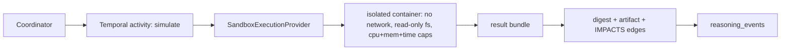

# Simulation Architecture

**Version:** 1.0 · **Status:** design
**Ports:** `SimulationEngine`, `SandboxExecutionProvider` ([PORTS.md §8, §11](PORTS.md)) ·
**Storage:** `simulation_specs`, `simulation_runs` ([DATA_MODEL.md §10](DATA_MODEL.md)) ·
**Requirements:** FR-801 … FR-806, NFR-008 · **ADR:**
[ADR-018](adr/ADR-018-sandbox-execution-boundary.md)

## 1. What a simulation result means

A simulation answers one question: *given this explicitly stated model of the world, what
follows?* It never answers "what will happen". Every result is therefore inseparable from its
validity domain, and the platform enforces that by making `validity_domain` and `assumptions`
required fields of the spec, not optional commentary (FR-804).

Simulation output is **evidence about the model**, and enters the graph as an `EVIDENCE` artifact
with an `IMPACTS` edge to the alternatives and claims it bears on. It is never a verdict.

## 2. Engines

| Engine | Method | MVP | Notes |
| --- | --- | --- | --- |
| `deterministic` | closed-form evaluation of a difference/stock model | yes | fastest, used as the baseline and the sanity check |
| `monte_carlo` | sampling over parameter distributions | yes | requires declared distributions, not point guesses |
| `system_dynamics` | feedback loops, stocks and flows | yes | the workhorse for policy questions |
| `agent_based` | heterogeneous interacting agents | *(research)* | Phase 16; needs its own validation story |
| `optimization` | search for policy that maximises an objective | *(research)* | interacts with MARL ([MARL_MODEL.md](MARL_MODEL.md)) |

Engines are adapters behind one port. Adding one does not touch the coordinator, the graph or
the API ([EXTENDING.md](EXTENDING.md)).

## 3. SimulationSpec

```jsonc
{
  "spec_id": "sim_01H...",
  "kind": "system_dynamics",
  "model": { "stocks": [...], "flows": [...], "auxiliaries": [...], "links": [...] },
  "parameters": [
    { "name": "adoption_rate", "distribution": { "type": "triangular",
      "min": 0.05, "mode": 0.12, "max": 0.30 }, "source": "art_01H..." }
  ],
  "scenarios": [ { "name": "baseline", "overrides": {} },
                 { "name": "subsidy",   "overrides": { "price_elasticity": -0.8 } } ],
  "horizon": { "steps": 60, "dt": 1, "unit": "month" },
  "outputs": ["uptake", "cost_cumulative", "emissions_cumulative"],
  "assumptions": ["asm_01H...", "asm_01H..."],
  "validity_domain": "national level, 2025-2030, no supply shock",
  "budget": { "max_runs": 20000, "max_seconds": 120, "max_cost_usd": 2.0 },
  "seed": 20260904,
  "engine_version": "sd-engine@1.2.0"
}
```

- **SP-1** `spec_hash` covers the whole document including `engine_version` and `seed`. Two runs
  with different hashes are different experiments, not duplicates.
- **SP-2** Every parameter with uncertainty declares a distribution *and a source*. A bare number
  is allowed only when `source` resolves to a `FACT` or a validated `EVIDENCE` artifact.
- **SP-3** `assumptions` must reference existing `ASSUMPTION` artifacts. A simulation cannot
  introduce an unstated assumption (FR-802).
- **SP-4** The spec is authored by an agent or a human and is immutable once a run exists.

## 4. Validation before execution

A spec is checked before it is allowed to consume budget:

| Check | Failure code |
| --- | --- |
| Graph well-formedness: no orphan stocks, every flow has a source and sink | `SPEC_UNLINKED` |
| Dimensional consistency of every equation | `SPEC_DIM_MISMATCH` |
| Units declared for all parameters and outputs | `SPEC_UNIT_MISSING` |
| Conservation laws where declared (mass, budget, population) | `SPEC_CONSERVATION` |
| Horizon and `dt` compatible with the fastest loop (stability) | `SPEC_UNSTABLE` |
| Parameter ranges physically admissible | `SPEC_RANGE` |
| Budget within session limits | `SPEC_BUDGET` |

Validation results are stored on the spec and rendered in the UI before a run button exists.
A spec that fails validation may still be run with `--allow-invalid`, and the run is permanently
labelled `INVALID_SPEC` ([EXPLAINABILITY.md](EXPLAINABILITY.md)).

<!-- trace: FR-801 -->
## 5. Execution path



The model code executes inside the sandbox boundary defined in
[ADR-018](adr/ADR-018-sandbox-execution-boundary.md): no network egress, read-only mounted
inputs, CPU and memory caps, wall-clock kill, and a byte-limited stdout channel. The provider
returns `(exit_code, stdout_digest, artifact_bytes, resource_usage)`. Nothing in the sandbox can
write to the database, and nothing outside it can be told what to believe by sandbox output —
results are parsed against the declared `outputs` schema or rejected.

## 6. Results

A `simulation_runs` row stores the result bundle:

| Field | Content |
| --- | --- |
| `point` | mean or median per output per scenario, as declared |
| `interval` | central interval (default 80 %) — never a bare point |
| `distribution` | histogram or quantile summary in object storage when requested |
| `convergence` | effective sample size, R̂ where applicable, `CONVERGED` / `NOT_CONVERGED` |
| `sensitivity` | Sobol indices or one-at-a-time ranks, with the method named |
| `scenario_delta` | difference from the baseline scenario, with its own interval |
| `resource_usage` | wall time, CPU-seconds, peak memory, cost estimate |
| `warnings` | stability warnings, clipped parameters, exhausted budget |

- **R-1** A result whose `convergence = NOT_CONVERGED` may not be attached as evidence; it may
  be attached as a `CLAIM` about the run.
- **R-2** Sensitivity is reported for every parameter that was given a distribution. A parameter
  the model is sensitive to and the user did not know about is the main risk here.
- **R-3** `scenario_delta` is the only comparison the UI may render as "effect"; comparing across
  specs is undefined.

## 7. How results enter reasoning

```text
EVIDENCE (kind = SIMULATION_RESULT)
   ├─ IMPACTS → ALTERNATIVE | CLAIM
   ├─ SOURCED_FROM → SIMULATION_RUN → SIMULATION_SPEC
   └─ SUPPORTS | OPPOSES → CLAIM
```

The `IMPACTS` edge carries `direction`, `magnitude` and `confidence`, and its `basis` field must
name the output and scenario it comes from. An agent that cites a simulation must state which
assumption in the spec it considers load-bearing; that link is what `impact_of(assumption)`
traverses when the assumption is later defeated (FR-408).

## 8. Budgets

Budgets are enforced at three levels, and the tightest wins:

| Level | Enforced by | On exhaustion |
| --- | --- | --- |
| Spec | validation stage | `SPEC_BUDGET`, no run started |
| Session | coordinator ledger counters | `BUDGET_EXCEEDED` event, round aborted, partial results kept and labelled |
| Workspace | monthly aggregate | new simulation requests rejected with the current spend shown |

Partial results are never discarded. A truncated Monte-Carlo run is a data point about cost, and
it is stored with `convergence = NOT_CONVERGED` and the sample count it reached.

## 9. Failure modes

| Failure | Detection | Behaviour |
| --- | --- | --- |
| Sandbox timeout | wall-clock kill | `SIM_TIMEOUT`, retry once with the same seed, then surface |
| Numerical blow-up | NaN/Inf in outputs, stability check | `SIM_UNSTABLE`, offending step recorded |
| Non-convergence | R̂ / ESS thresholds | result stored, `NOT_CONVERGED`, evidence attachment blocked (R-1) |
| Output schema mismatch | parse failure | `SIM_SCHEMA`, raw digest kept for inspection |
| Engine unavailable | port error | `SIM_UNAVAILABLE`, session continues without simulation |
| Seed collision in an experiment | harness check | experiment flagged, not silently re-seeded |

## 10. Reproducibility

A run is reproducible from `(spec_hash, engine_version, seed, image_digest)`. Re-running with the
same tuple MUST produce identical outputs; if it does not, the engine is non-deterministic and is
removed from the registry until fixed (NFR-003). Parallelism inside an engine must be
deterministic-reduction or explicitly declared non-reproducible in the engine's registration
record.

## 11. Out of MVP scope *(research)*

Coupled multi-model pipelines, calibration against historical data, optimisation-in-the-loop
policy search, and agent-based engines. Each is tracked in
[RESEARCH_NOTES.md](RESEARCH_NOTES.md).

## 12. Related

[NEURO_SYMBOLIC.md](NEURO_SYMBOLIC.md) · [MARL_MODEL.md](MARL_MODEL.md) ·
[REPRODUCIBILITY.md](REPRODUCIBILITY.md) · [DATA_MODEL.md §10](DATA_MODEL.md) ·
[PORTS.md §8, §11](PORTS.md) · [MVP_BOUNDARY.md](MVP_BOUNDARY.md)

